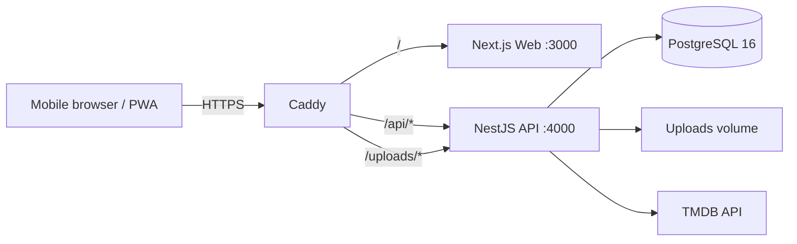

# Davas System Overview

이 문서는 현재 codebase의 구조를 빠르게 탐색하기 위한 지도다. 제품 요구의 권위는 [`../product/core-experience.md`](../product/core-experience.md), 실제 동작의 권위는 코드와 migration이다.

## Runtime topology



Production services are defined in `docker-compose.prod.yml`. Local Compose uses PostgreSQL, API, and Web without Caddy.

## Repository map

```text
apps/web/                 Next.js App Router PWA
apps/api/                 NestJS API and TypeORM migrations
packages/shared/          Shared enums and contracts
deploy/Caddyfile          Production reverse proxy
deploy/backup.sh          PostgreSQL + uploads backup
docs/                     Role-based source documents
.agents/skills/           Project-local reusable Agent workflow
scripts/                  Deterministic test/docs harness
```

## Core Web routes

| Route | 역할 |
| --- | --- |
| `/` | 친구와 본인의 최신 친구 공개 기록 |
| `/records/new` | 작품 찾기 + 기록 작성 |
| `/records/:id` | 기록 상세 |
| `/records/:id/edit` | 내 기록 수정 |
| `/search?scope=friends|mine` | 두 축 기록 검색 |
| `/me` | 내 기록 |
| `/friends` | 친구 요청·목록·초대 |
| `/friends/invite/:token` | 친구 초대 확인 |
| `/settings` | 프로필·계정 설정 |
| `/login`, `/signup` | 인증과 가입 초대 |
| `/terms`, `/privacy` | 공개 legal route |
| `/offline` | PWA offline 안내 |

Legacy `/diary`, `/community`, `/feed`, `/explore`, `/watchlist`, `/profile` route는 새 IA로 redirect한다. 새 기능의 근거로 사용하지 않는다.

## Core UI boundaries

- `apps/web/src/components/core/CoreUi.tsx`: 4-tab shell, header, controls, cards, async states
- `apps/web/src/components/core/RecordComposer.tsx`: FIND-01/WRITE-01 create·edit flow
- `apps/web/src/components/core/RecordScreens.tsx`: feed, mine, search, detail
- `apps/web/src/components/friends/`: friend management and invite acceptance
- `apps/web/src/components/settings/`: profile/account settings
- `apps/web/src/lib/api/core.ts`: current record API client

기존 `home`, `diary`, `community`, `watchlist`, `profile` component 일부는 data compatibility를 위해 남아 있다. Core IA 노출 여부는 route와 `CoreUi.tsx`를 기준으로 판단한다.

## API boundaries

- Global prefix: `/api`
- Global validation: whitelist + transform + forbid non-whitelisted
- API responses: `Cache-Control: private, no-store`
- Swagger: `/api/docs`

현재 핵심 module:

| Module | 책임 |
| --- | --- |
| `auth` / `invites` | login, signup, 가입 초대 code, cookie session |
| `media` | TMDB search/detail, internal media selection |
| `diaries` | create/detail/update/delete, feed/me filters, access policy |
| `friends` | request state, search, one-time friend invite token |
| `users` | profile update and account deletion |

Legacy comments, reactions, notifications, recommendations, watchlist module은 schema/API compatibility를 위해 남아 있지만 core IA에는 노출하지 않는다.

## Data contract

Shared enums are defined in `packages/shared/src/index.ts`.

- `MediaType`: `MOVIE | TV`
- `ViewingMethod`: `THEATER | OTT`
- `DiaryVisibility`: `PRIVATE | FRIENDS | SELECTED`
- New create allows `FRIENDS | PRIVATE`; `SELECTED` is legacy read/edit compatibility only.
- New record defaults to `FRIENDS`.
- `rating` is nullable and otherwise an integer from 1 to 5.
- `content` is optional, trimmed, maximum 500 characters.
- `clientRequestId` and immutable fingerprint provide idempotent create.
- Friend/missing record access is hidden behind the same `RECORD_NOT_FOUND` 404.

## Migration chain

Order is fixed in `apps/api/src/database/typeorm.config.ts`.

1. `BaseSchema1720670300000`
   - Additive baseline for empty and legacy synchronize-created databases
   - `down` intentionally preserves pre-existing tables
2. `HighValueFlows1720670400000`
   - Legacy PUBLIC→PRIVATE narrowing and compatibility tables/data
3. `CoreRecordContract1720670500000`
   - `viewing_method`, nullable rating, `shared_at`, idempotency and cursor indexes
4. `FriendInvitesAndConsents1720670600000`
   - Friend invite tokens, legal consent, file cleanup jobs

기존 migration을 수정하지 않는다. Schema 변경은 새 additive migration으로 추가한다.

## Security invariants

- TMDB key와 JWT secret은 server environment에만 둔다.
- PostgreSQL, API `4000`, Web `3000`은 production router에 직접 노출하지 않는다.
- Record visibility는 UI가 아니라 server access policy가 매 요청 판정한다.
- Friend invite 원문 token은 DB에 저장하지 않고 hash만 저장한다.
- Production은 `TYPEORM_SYNC=false`다.
- DB와 uploads를 함께 backup하지 않은 schema-changing deploy는 진행하지 않는다.

## PWA

- Manifest: `apps/web/src/app/manifest.ts`
- Service worker: `apps/web/public/sw.js`
- Install/update UI: `apps/web/src/components/pwa/`
- Offline route: `apps/web/src/app/offline/`

개인 기록을 새 persistent offline cache에 저장한다고 가정하지 않는다. Offline write는 성공으로 가장하지 않고 입력을 유지한 뒤 재연결 후 명시적으로 재시도한다.
