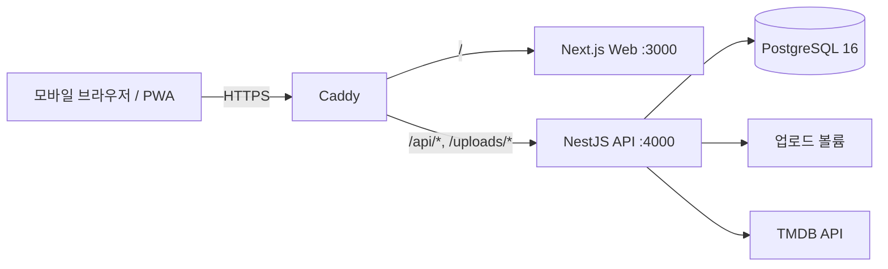

# Davas 개발 가이드

로컬 실행부터 코드 구조, 데이터베이스, 검증 명령까지 개발에 필요한 내용을 한곳에 모은 문서다. 제품 방향은 [제품 기준 문서](product/README.md), 운영 서버 절차는 [운영 가이드](operations.md)를 따른다. 실제 동작의 최종 근거는 코드, migration, package script, Compose·Caddy 설정이다.

## 1. 준비물

- Node.js 24 (Docker 이미지와 같은 버전), npm 10 이상
- Docker Engine과 Compose plugin
- TMDB API 키 (실제 작품 검색을 확인할 때만)

```bash
npm ci
```

저장소에 커밋된 `package-lock.json`과 npm만 사용한다.

## 2. 로컬 실행

### A. Docker Compose로 전체 실행

```bash
npm run docker:up      # 빌드 후 백그라운드 실행
npm run docker:logs
npm run docker:down
```

| 대상 | 주소 |
|---|---|
| Web | <http://localhost:3000> |
| API | <http://localhost:4000/api> (상태 확인: `/api/health`) |
| Swagger | <http://localhost:4000/api/docs> (개발 환경에서만 열림) |
| PostgreSQL | `localhost:5432` |

> **데이터 삭제 주의:** `docker compose down -v`는 로컬 PostgreSQL과 업로드 볼륨을 영구 삭제한다. 깨끗한 DB가 꼭 필요할 때만 쓴다.

로컬 Compose는 운영과 같은 방식으로 이미지를 빌드하지만 `TYPEORM_SYNC=true`, `NODE_ENV=development`로 실행한다. 운영 migration 리허설 용도가 아니다.

### B. Web·API는 직접, PostgreSQL만 Docker로

```bash
cp apps/api/.env.example apps/api/.env
cp apps/web/.env.example apps/web/.env.local
docker compose up -d db
npm run dev            # API와 Web을 함께 실행 (npm run dev:api / dev:web 로 따로 실행 가능)
```

Windows PowerShell에서는 `cp` 대신 `Copy-Item`을 쓴다.

### 환경 변수

| 파일 | 주요 값 |
|---|---|
| `apps/api/.env` | `DB_*`, `JWT_ACCESS_SECRET`(32자 이상), `CORS_ORIGINS=http://localhost:3000`, `COOKIE_SECURE=false`, `SWAGGER_ENABLED`, `TMDB_API_KEY` |
| `apps/web/.env.local` | `NEXT_PUBLIC_API_BASE_URL=http://localhost:4000/api` |
| `.env.production` | 운영 Compose 전용. 절대 커밋하지 않는다 ([운영 가이드](operations.md#2-최초-설정)) |

`TMDB_API_KEY`가 없어도 앱은 시작하지만 작품 검색·상세·가용성 요청은 설정 오류를 반환한다. 브라우저는 TMDB를 직접 호출하지 않는다.

## 3. 코드 지도

### 실행 구조



로컬 Compose에는 Caddy가 없고 Web·API 포트를 직접 연다.

### 저장소 구조

```text
apps/web/          Next.js App Router PWA
apps/api/          NestJS API, TypeORM entity·migration, API 테스트
packages/shared/   API와 Web이 함께 쓰는 타입·상수 (@davas/shared)
deploy/            운영 Caddyfile, 백업 스크립트
scripts/           테스트 실행기와 검증 스크립트 (npm run verify 가 사용)
docs/              이 문서들
graphify-out/      Graphify 코드 그래프 (도구가 생성, 손으로 수정하지 않음)
```

### Web 화면

하단 탭은 홈(`/`), 탐색(`/explore`), 가운데 볼록한 기록(`/records/new`), 공간(`/spaces`), 내 기록(`/me`) 다섯 개이고, 헤더에는 알림(`/notifications`, 안 읽은 알림 수)과 설정(`/settings`) 아이콘이 있다. 폭 1024px 이상에서는 헤더와 하단 탭 대신 왼쪽 248px 사이드바(로고, 공간 전환, 기록 남기기, 탭, 알림·설정)가 나오고, 홈은 제목·소개 문구·작품 찾기 링크 아래 타임라인과 오른쪽 칸(오늘 밤 후보, 확인 요청)으로 나뉘고(추천 줄은 숨김, 카드의 사진은 제목 옆), 기록 상세는 사진과 정보 두 칸에 리뷰가 나란히 놓이며(사진이 없으면 760px 한 칸, 뒤로가기 줄은 본문 폭에 맞춰 밑줄, 댓글 보내기 버튼에 "보내기" 글자, 기록을 보는 동안 사이드바는 홈 선택), 공간 탭은 공간 이름 제목 아래 멤버 2칸 타일, 한 줄짜리 초대 줄, 기능 2×2 카드로 보이고, 나머지 화면은 760px 한 칸이다. 작품 상세는 휴대폰에서 아래에서 올라오는 시트(손잡이를 끌어 내리면 닫힘), 컴퓨터에서 가운데 창이다. 홈과 공간 탭의 헤더 왼쪽은 로고 대신 공간 전환 버튼(구성원 아바타, 공간 이름, 인원)이고, 누르면 내 공간 목록과 "공간 관리"가 펼쳐진다. 친구 화면(`/friends`)은 공간 화면에서 들어가며, 그동안 공간 탭이 선택된 상태로 보인다.

| 경로 | 역할 |
|---|---|
| `/` | 활성 공간(마지막으로 고른 공간)의 오늘 밤 후보(같이 보고 싶어요 목록에서 고른 한 편), 함께 봤는지 확인 요청(`GET /v1/spaces/:spaceId/pending-confirmations`로 따로 받아 최근 기록 5개 밖의 요청도 보인다), 최근 기록 5개("전체"는 `/spaces?view=timeline`)와 추천 작품. 공간이 없으면 공간 만들기 안내 |
| `/records/new` | 작품 찾기 → 기록 남기기 (`?step=find`, `?mediaId=`). 새 기록은 활성 공간이 공유 대상으로, 2명 공간이면 상대가 함께 본 사람으로 미리 선택된다. 작성 화면은 작품 → 공유할 곳(한 줄 요약, 눌러서 바꿈) → 본 날짜 → 어디서 봤나요(극장은 이름·상영 형식·좌석, OTT는 서비스, 드라마는 회차) → 함께 본 사람 → 별점 → 한줄평 → 소감 → 스포일러 → 블라인드(함께 본 사람 이름으로 켜고 끈 결과를 알려 줌) → 추억 메모 → 사진 순서다 |
| `/records/:id`, `/records/:id/edit` | 감상 상세, 수정. 상세는 사진 → 작품·함께 본 사람·감상 정보 칩 → 확인 요청 배너(내가 응답 대기일 때) → 우리 리뷰(내 리뷰는 카드에서 펼쳐 쓰고 고친다, `#my-review`로 열면 바로 펼침) → 추억 메모 → 댓글(입력창은 화면 아래 고정) 순서다. 수정·다시 기록·삭제는 헤더의 "…" 메뉴에 있고, 삭제는 포커스를 가두는 확인 창에서 묻는다. 작성자와 함께 봤다고 확인한 사람은 감상 정보 칩 아래 "내 사진 더하기"로 자기 사진을 올리고 고친다 |
| `/search?scope=mine`, `scope=space`, `scope=friends` | 기록 검색. 내 기록(내가 쓰거나 함께 봤다고 확인한 기록)과 우리 공간(활성 공간에 공유된 기록)은 제목·원제, 함께 본 사람, 장소, OTT, 추억 메모, 리뷰에서 찾고 찾은 곳을 표시한다(작품 종류·관람 방식 필터). 친구는 예전 친구 기록 검색 |
| `/explore` | 탐색: 영화·드라마 제목 검색, 지금 화제작(영화/드라마), 기분 카드 4개(장르 추천 `light-comedy`, `immersive-thriller`, `good-cry`, `chills`), 함께 고르기 링크. 작품을 누르면 작품 상세 시트가 열린다 |
| `/me` | 내 기록: 내가 쓰거나 함께 봤다고 확인한 기록을 최신순으로, 기록 검색과 같은 카드로 보인다(`/v1/watch-events/search?scope=mine`을 검색어 없이 부른다). 검색 칸 모양 버튼은 `/search?scope=mine`으로 간다 |
| `/friends`, `/friends/invite/:token` | 친구 목록·요청·초대 |
| `/spaces`, `?view=timeline`, `?view=recommend`, `/spaces/invite/:token` | 공간 탭은 멤버 카드(제목 옆 인원, 정원이 차면 주황색과 안내, 소유자의 "공간 이름 바꾸기"와 초대 링크 기간·만들기), 공간 기능 4줄(같이 보고 싶어요, 함께 고르기, 우리 기록 모아보기, 기록 검색), 공간 관리(새 공간, 소유권 넘기기, 나가기·종료가 눌러야 펼쳐지는 줄로 접혀 있음) 순서다. `?view=timeline`은 공간 타임라인 전체, `?view=recommend`는 함께 고르기 화면(그룹 추천, 내가 시작했거나 초대된 "최근 함께 고르기"를 열어 답함)이다. 모두 동의한 후보에는 "이걸로 볼게요"가 나오고, 누르면 그 함께 고르기가 끝나며 정한 작품이 홈의 "오늘 밤 후보"(같이 보고 싶어요 빠른 추천보다 먼저)에 3일 동안, 또는 참여자 누군가 그 작품을 기록할 때까지 보인다. 시작한 사람은 "그만 고르기"로 끝낼 수 있고, 시작한 지 7일이 지난 함께 고르기는 끝난 것으로 보고 답을 받지 않는다. 목록에서 연 함께 고르기도 저장된 조건으로 "같은 조건으로 새 추천"을 할 수 있다. 후보는 참여자가 아직 보지 않았고 거절하지 않은 작품 중, 고른 OTT의 구독(무료·광고 포함)으로 볼 수 있는 작품에서만 나온다(대여·구매만 되는 작품은 빠진다). 그런 작품이 30개보다 적으면 TMDB에서 고른 OTT가 서비스하는 인기작(분위기 장르 우선, 피할 장르 제외)을 최근 18개월 안에 나온 작품부터, 모자라면 전체 인기작에서 최대 20개 들여오고, TMDB의 OTT 목록을 못 읽으면 이번 주 인기작으로 대신한다. 볼 수 있는 곳은 한 번에 최대 24개 작품만 새로 확인한다. 참여자별 점수는 그 사람 자신의 기록만으로 읽은 취향(`recommendations/taste-profile.ts`)에서 나온다. 본 작품(다시 본 작품은 더 크게), 같이 보고 싶어요, 별점(그 사람의 평소 별점 습관에 비춰), 함께 고르기 관심·거절이 신호이고, 최근 기록일수록 무게가 크다(1년 반 전 기록은 절반). 장르가 모든 작품 중에서보다 그 사람 기록에 얼마나 더 자주 나오는지를 보고, 근거가 적으면 불확실성이 커진다. 다른 구성원의 취향을 빌려오지 않는다. 같은 날 함께 본 기록은 공간 취향으로 묶어 "함께 본 기록에 맞아요" 후보를 고른다. 최근 2년 안에 나온 작품일수록, 그리고 후보 가운데 TMDB 인기도(`media.tmdb_popularity`, 작품을 저장하거나 들여오기 결과에서 다시 볼 때 갱신)가 높을수록 조금 앞에 놓이고, 인기도가 가장 높은 후보에 가까우면 "요즘 많이 보는 작품이에요" 이유가 붙는다. "취향 정보가 적어요" 이유는 참여자들의 평균 불확실성이 0.6 이상일 때만 붙는다. 점수 공식을 바꿀 때는 `npm run recommendation:backtest -- <스냅숏.json>`으로 실제 기록을 다시 돌려 이전 방식과 비교한다(각자 최근 기록 40편을, 그날까지 나와 있었고 아직 안 본 작품들 사이에서 몇 번째로 골랐을지 잰다). 스냅숏은 사람의 감상 기록이라 저장소에 두지 않고, 만드는 방법은 [운영 가이드](operations.md#6-일상-운영)에 있다. 공간 초대는 카드 하나로 누가 어느 공간에 초대했는지, 인원, 만료 시각을 보이고 참여하기와 확인 창을 거치는 초대 거절을 둔다. 정원이 차면 같은 카드에 안내와 꺼진 참여하기를 보인다 |
| `/spaces/memories`, `?view=calendar` | 우리 기록 모아보기: 한 해 돌아보기(연말 결산 카드와 이미지 저장, 장르·극장 vs OTT, 1년 전 오늘, 보고 있는 드라마)와 달력(달마다 본 날에 첫 기록, 날을 누르면 그날 기록) |
| `/notifications` | 알림 센터: 새 기록, 함께 봤는지 확인 요청, 열린 블라인드 리뷰, 좋아요·댓글, 같이 보고 싶어요 겹침. 모두 읽음 |
| `/spaces/wishes` | 활성 공간의 같이 보고 싶어요 목록: 누가 담았는지, 모두 담았는지, 구독 OTT에서 볼 수 있는지, 빠른 추천(기분 선택·다른 후보) |
| `/settings` | 프로필·사진, 구독 중인 OTT, 알림 종류별 켜고 끄기, 비밀번호 변경과 복구 코드, 내 데이터 내려받기, 로그아웃, 법률 문서, 계정 삭제(30일 유예) |
| `/login`, `/signup` | 로그인(삭제 대기 계정은 되살리기 안내), 초대 코드·친구 초대 가입 |
| `/password-reset` | 복구 코드로 잊은 비밀번호 다시 정하기 |
| `/terms`, `/privacy`, `/offline` | 법률 문서, PWA 오프라인 안내 |

예전 경로(`/diary`, `/community`, `/feed`, `/watchlist`, `/profile`)는 새 화면으로 돌려보낸다. 자세한 내용과 알려진 문제는 [부록](appendix.md#1-레거시-호환과-알려진-문제)에 있다.

주요 Web 코드:

- `src/components/core/`: 공통 화면 틀(`CoreUi.tsx`), 홈의 공간 영역(`SpaceHome.tsx`), 기록 작성(`RecordComposer.tsx`, 입력 부품 `ComposerFields.tsx`, 사진 선택 `PhotoPicker.tsx`), 목록·검색(`RecordScreens.tsx`), 감상 상세(`WatchEventDetailScreen.tsx`, 리뷰·댓글 `WatchReviews.tsx`, 사진 `WatchPhoto.tsx`·`WatchPhotoGallery.tsx`)
- `src/components/spaces/`: 공간 화면(`SpacesScreen.tsx`), 타임라인(`SpaceTimeline.tsx`, 홈과 같이 쓰는 카드 `SpaceWatchCard.tsx`와 같은 작품을 묶은 카드 `SpaceWatchGroupCard.tsx`, 불러오기 `hooks/useSpaceTimeline.ts`), 활성 공간·기본 참여자 규칙(`space-ui.ts`), 그룹 추천 패널(`GroupRecommendationPanel.tsx`). 홈의 "함께 고르기"가 `/spaces?view=recommend`로 연결된다.
- `src/components/friends/`, `settings/`
- `src/lib/api/`: API 호출 함수. 공통 호출기 `core.ts`의 `coreFetch`가 401이면 임시저장을 지우고 로그인 화면으로 보낸다.
- `src/lib/core-routes.ts`: 로그인 후 돌아갈 수 있는 경로의 허용 목록
- `src/middleware.ts`: 로그인 필요 경로 검사와 예전 경로 전환

### API 모듈

모든 경로는 `/api` 아래에 있다. 새 계약은 `/api/v1`에 추가한다.

| 모듈 | 책임 |
|---|---|
| `auth`, `invites` | 로그인·가입·로그아웃, 비밀번호 변경, 복구 코드 발급과 비밀번호 재설정(`/auth/password/reset`, 공개), 가입 초대 코드, 쿠키 세션 |
| `users` | 프로필, 프로필 사진 업로드, 데이터 내보내기, 탈퇴 신청(30일 유예)·복구, 유예가 지난 계정을 매시간 영구 삭제하는 작업 |
| `friends` | 친구 요청·목록·검색, 일회성 친구 초대 토큰 |
| `spaces` | 2~5명 공유 공간, 이름 변경, 공간 초대(수락·거절), 소유권 이전·탈퇴·종료 (`/v1/spaces`, `/v1/invites`). 공개된 초대 확인(`GET /v1/invites/:token`)은 쓸 수 있거나 정원이 찬 초대에 공간 이름, 초대한 사람, 만료 시각과 구성원 수·정원·닉네임 첫 글자만 담는다 |
| `diaries` | 예전 기록 목록(친구 기록 `/diaries/feed`, 내 기록 `/diaries/me`)과 감상 사건·참여자·개인 반응(`/v1/watch-events`), 기록 검색(`/v1/watch-events/search`), 내 사진(`PUT /v1/watch-events/:id/photos`), 공간 타임라인·모아보기·달력(`/v1/spaces/:spaceId/calendar?month=`) |
| `media` | TMDB 검색·상세·인물 검색, 작품 선택(서버가 TMDB 원본 저장), 시청 가능성(`/media/:id/availability`) |
| `recommendations` | 탐색·홈의 인기작(`/recommendations/trending`)과 분위기 카드별 장르 추천(`/recommendations/genres/:presetId`), 그룹 추천 세션과 피드백(`/v1/recommendation-sessions`, 공간의 최근 세션 `/v1/spaces/:spaceId/recommendation-sessions`, 정하기 `POST .../:sessionId/decision`, 끝내기 `POST .../:sessionId/close`, 홈의 정한 작품 `GET /v1/spaces/:spaceId/recommendation-sessions/decided`), 공간의 같이 보고 싶어요 목록과 빠른 추천(`/v1/spaces/:spaceId/wishes`) |
| `notifications` | 알림 목록과 알림 설정 |
| `outbox` | 트랜잭션 아웃박스 저장 (소비 워커는 아직 없음) |
| `comments` | 기록 댓글(`/diaries/:id/comments` 쓰기·읽기, `DELETE /comments/:id`) |
| `watchlist` | 작품 상세의 "보고 싶어요"(`POST /watchlist`, `DELETE /watchlist/:id`) |

공간에 묶인 데이터는 반드시 `SpaceAccessService`(공간)와 `DiaryAccessService`(기록) 권한 경계를 거친다. 권한이 없는 리소스는 존재 여부가 드러나지 않게 404로 응답한다.

### 공유 계약

API와 Web이 같은 의미로 쓰는 타입·상수는 `packages/shared/src/index.ts`(TO-BE 도메인 타입)와 `contracts.ts`(기록·작품 응답 계약)에 둔다. 공유 타입을 바꾸면 `npm run build --workspace @davas/shared` 후 API·Web을 함께 검증한다.

## 4. API 보안 경계

| 장치 | 동작 | 위치 |
|---|---|---|
| 기본 로그인 요구 | 모든 경로가 `davas_access_token` 쿠키를 요구. 공개 경로만 `@Public()`. 공개지만 로그인 사용자를 구분해야 하면 `OptionalJwtCookieAuthGuard` 추가 | `auth/jwt-cookie-auth.guard.ts`, 공개 목록 테스트 `common/core-runtime-surface.spec.ts` |
| 컨트롤러 규칙 | 호출자는 `request.user`(`AuthenticatedRequest`)로만 읽는다. 컨트롤러에서 쿠키를 직접 읽거나 `AuthService`를 부르지 않는다 | `auth/controller-auth-policy.spec.ts` |
| 출처 검사 | POST·PATCH·DELETE 요청의 `Origin`이 `CORS_ORIGINS`와 다르면 403 | `common/app-security.ts` |
| 요청 횟수 제한 | 클라이언트 IP별 분당 300회 기본, 로그인 5분 10회, 검색·TMDB 별도 한도. 운영은 Caddy 한 단계만 신뢰해 실제 IP로 계산 | `common/request-limits.ts`, `TRUST_PROXY_HOPS` |
| 업로드 | 로그인 확인 후 파일 수신, 5MB 상한, 파일 내용으로 이미지 형식 확인, 동시 업로드 제한, 교체·삭제 시 이전 파일 정리. `/uploads` 정적 경로는 업로드 볼륨 전체가 아니라 `profile-images` 폴더만 그 폴더를 뿌리로 내보내서, 주소를 어떻게 바꿔 적어도(`watch%2Dphotos`, `..`) 기록 사진에 닿지 않는다 | `users/profile-image-upload.ts`, `common/public-uploads.ts`, `npm run verify:upload` |
| 작품 저장 | 브라우저는 공급자 ID만 보내고 제목·이미지는 서버가 TMDB에서 받아 저장. TMDB 호출은 5초 안에 답이 없으면 포기한다 | `media/media-selection.service.ts`, `media/tmdb.client.ts` |
| 응답·설정 | 보안 헤더(Helmet, 운영은 Caddy가 최종), `Cache-Control: private, no-store`, 운영에서 Swagger 끔, 필수 설정이 없으면 운영 API가 시작을 거부 | `main.ts`, `common/app-security.ts` |
| 로그인 후 이동 | `returnTo`는 허용 목록 경로만 사용. 새 화면을 추가하면 목록도 갱신 | `apps/web/src/lib/core-routes.ts` |

## 5. 데이터베이스와 migration

- 로컬은 `TYPEORM_SYNC=true`로 entity 기준 자동 동기화를 쓸 수 있다. 버려도 되는 로컬 데이터에서만 쓴다.
- 운영은 항상 `TYPEORM_SYNC=false`이고, 빌드된 API의 migration만 사용한다.
- 스키마 변경은 새 migration으로만 추가한다. 이미 적용됐을 수 있는 migration은 수정하지 않는다.
- 새 migration의 timestamp는 `1720671100000`보다 커야 한다.
- `1720670700000`~`1720671100000` 구간은 두 작업 줄기가 같은 숫자를 썼다. 해당 10개 class 이름은 운영 기록과 이름으로 맞물려 있으므로 절대 바꾸지 않는다([부록](appendix.md#1-레거시-호환과-알려진-문제)).

```bash
# 개발용 (TypeScript 소스 기준)
npm run migration:show:src --workspace @davas/api
npm run migration:run:src --workspace @davas/api
npm run migration:revert:src --workspace @davas/api

# 운영과 같은 방식 (빌드된 dist 기준) 리허설: TYPEORM_SYNC=false로 설정 후
npm run build --workspace @davas/api
npm run migration:show --workspace @davas/api
npm run migration:run --workspace @davas/api
npm run migration:show --workspace @davas/api
```

기록 계약 요약:

- 영화·드라마 구분은 작품(`MOVIE`/`TV`)에, 시청 방식(`THEATER`/`OTT` 등)은 기록마다 저장한다. 서비스 이름(`providerName`)은 OTT일 때만 저장해서, OTT로 고르다 극장으로 바꾼 기록에 서비스 이름이 남지 않는다.
- 날짜는 한국 날짜 기준이다. "오늘 이후는 저장할 수 없음" 같은 판단은 `common/seoul-date.ts`를 쓴다(UTC로 비교하면 밤 12시~오전 9시에 오늘이 내일로 판정된다).
- 작성 화면은 탭에 저장하지 않은 기록 하나를 임시로 남기고, 같은 작품을 다시 열거나 작품 선택 전일 때만 되살린다. 다른 작품이면 새로 시작한다(`components/core/composer-draft.ts`).
- 감상 사건(`/v1/watch-events`)의 별점은 미평가 또는 0.5~5.0(0.5 단위)이다. 기록은 감상 사건 API로만 쓰고 고친다.
- 개인 리뷰(`watch_reactions`)는 별점·한줄평(40자)·소감(2,000자)·스포일러·블라인드 여부를 가진다. 블라인드 공개 규칙은 `diaries/blind-review.ts` 한 곳에 있고, 감상 상세·타임라인·반응 비교·예전 `/diaries/:id`·`/community/diaries/:id`가 모두 이 규칙으로 가린다. 함께 보지 않은 사람에게는 함께 봤는지 아직 답하지 않은 사람(PENDING)까지 모두 써야 열려서, 누가 확인을 눌러도 열렸던 리뷰가 다시 잠기지 않는다. 가려진 리뷰는 내용·별점·좋아요 수·수정 시각을 보내지 않고, 화면은 보는 사람의 처지(함께 봄·확인 대기·함께 보지 않음)에 맞춰 무엇을 하면 열리는지 알려 준다(`space-watch-model.ts`의 `lockedReviewHint`). 함께 본 사람이 없으면 열어 줄 사람이 없으므로 작성 화면은 블라인드 스위치를 보여 주지 않고 저장도 꺼진 채로 한다. 리뷰 화면에서 쓰든 기록 수정에서 별점·리뷰를 쓰든, 그 순간 열린 블라인드 리뷰의 주인에게 알림이 간다.
- 구독 OTT: 사람마다 `users.ott_services`에 `OTT_SERVICES` 키(넷플릭스·티빙·쿠팡플레이·웨이브·디즈니+·왓챠·Apple TV+·프라임 비디오)를 저장한다(`PATCH /users/me`의 `ottServices`). 공유 타입의 `OTT_SERVICES`가 키, 한국어 이름, TMDB 제공자 이름을 함께 정의하고 서버·웹이 같이 쓴다.
- 같이 보고 싶어요: `space_wishes`의 한 행이 "이 구성원이 이 작품을 보고 싶다"다. 목록은 작품별로 묶어 모두 담았는지, 담은 뒤 공간에 공유된 기록이 새로 만들어졌는지(봤어요, 예전 기록을 고쳐도 바뀌지 않는다), 구성원 누군가의 구독 OTT에서 정액제로 볼 수 있는지를 알려 준다. 볼 수 있는 곳 정보는 목록 전체를 한 번에 읽고(`AvailabilityService.getCurrentMany`), 정보가 없거나 만료된 작품만 요청당 8편까지 TMDB에서 새로 받는다(결과는 6시간 보관). 빠른 추천(`/wishes/pick`)은 모두 담음 > 구독 OTT에서 볼 수 있음 > 기분 장르 순으로 점수를 매기고 `exclude`로 다음 후보를 고른다. 작품 상세 시트의 "보고 싶어요"는 공간이 있으면 이 목록을, 없으면 예전 개인 목록을 쓴다.
- 우리 기록 모아보기(`GET /v1/spaces/:spaceId/memories?year=`)는 공간에 공유된 기록만 센다. 공간을 떠난 사람의 기록은 편수·장르에는 남지만 사진·시청 방식·회차는 빠지고, 극장 vs OTT 비율은 시청 방식을 아는 기록끼리 나눈다. 1년 전 오늘은 한국 날짜 기준이다. 연말 결산(`recap`)은 그해 달별 편수, 처음·마지막 기록, 우리 별점 높은 작품(보는 사람에게 잠긴 블라인드 별점은 빼고 평균), 자주 간 곳·OTT, 대표 사진 4장을 담고, 화면은 같은 내용을 1080×1350 PNG로 그려 공유하거나 내려받는다(다른 출처 이미지는 넣지 않는다). 달력(`/calendar?month=YYYY-MM`)은 그달 공유 기록을 본 날로 묶고, 다른 사람 기록에는 작성자가 공간에 있는 동안 닉네임(`authorName`)을 붙인다. 화면은 기록이 있는 날을 첫 기록의 사진이나 포스터 칸으로 그린다. 드라마 진행은 작품마다 가장 최근 기록의 회차를 쓰고, `GET /v1/watch-events/progress/:mediaId`가 내 최신 진행을 돌려줘 새 기록이 다음 화부터 시작한다.
- 알림은 앱 안의 `notifications` 행이다(푸시·메일 없음). 새 기록 공유(공간 사람들), 함께 본 사람 확인 요청, 내 블라인드 리뷰가 상대에게 열림, 리뷰 좋아요, 댓글(작성자와 함께 본 사람 중 아직 기록을 볼 수 있는 사람, 댓글마다 한 번), 같이 보고 싶어요가 모두 겹침(`media_id`), 공간 초대 거절(초대한 사람), 함께 고르기 시작(참여자)과 첫 합의(`media_id`)를 남긴다. 종류는 `SPACE_INVITE`·`WATCH_PARTICIPATION`(끌 수 없음)·`SOCIAL`·`RECOMMENDATION` 네 묶음으로 설정에서 끈다. 알림을 못 남겨도 원래 요청은 성공한다(댓글도 저장된 뒤라 다시 보내 중복되지 않는다). `GET /notifications/unread-count`, `PATCH /notifications/read-all`.
- 계정: 로그인 쿠키의 JWT에 `sv`(세션 버전)가 들어가고 매 요청 `users.session_version`과 비교한다. 비밀번호를 바꾸거나 복구 코드로 다시 정하면 버전이 올라 다른 기기의 로그인이 끝난다. 복구 코드는 `ABCD-EFGH-JKMN` 꼴의 일회용이고 bcrypt 해시로만 저장한다. 삭제 대기 계정은 비밀번호가 맞을 때만 `ACCOUNT_DELETION_PENDING`(401)으로 알려, 등록된 이메일인지 드러내지 않는다.
- 그룹 추천 분위기: 화면의 분위기 단어(가벼운·긴장감 등)는 공유 표 `RECOMMENDATION_MOOD_GENRES`의 장르로 맞춘다. 표에 없는 태그(제외 조건에 쓴 "공포" 등)는 장르 이름으로 비교한다.
- 그룹 추천 후보: 저장된 작품이 60편보다 적으면 TMDB 주간 인기작 중 아직 저장하지 않은 작품을 20편까지 저장하고(앞 페이지가 이미 저장된 작품뿐이면 3페이지까지 본다), 표가 많은 작품 60편 중 볼 수 있는 곳 정보가 없거나 만료된 24편까지 세션을 만들 때 새로 받는다. 실패해도 세션은 있는 정보로 계속 만든다.
- 볼 수 있는 곳 정보는 TMDB의 JustWatch 제공 데이터다. 이 정보를 보여 주는 화면에는 출처를 적는다.
- 리뷰 좋아요: `PUT`/`DELETE /v1/watch-events/:id/reactions/:reactionId/like`. 내 리뷰와 잠긴 리뷰에는 누를 수 없다. 댓글은 기록 단위로 `/diaries/:id/comments`를 쓴다(500자).
- 사진: 작성 화면에서 고르는 즉시 `POST /v1/watch-photos`로 올리고(한 장 15MB, JPEG·PNG·WebP), 서버가 한 사람의 업로드를 동시에 2개까지만 받으므로 화면은 2장씩 차례로 보내고 바쁘다는 응답(429)이나 연결 끊김은 잠시 뒤 다시 보낸다. 큰 사진이 느린 망에서도 들어오도록 요청 수신 제한은 5분이다. 기록을 저장할 때 `photoIds` 순서대로 붙인다(최대 10장, 첫 장이 대표). 사진은 올린 사람이 각자 관리한다: 작성자와 함께 봤다고 확인한 사람이 `PUT /v1/watch-events/:id/photos`로 자기 사진만 바꾸고, 다른 사람 사진은 목록에 없어도 그대로 남는다. 10장은 모두 합친 수이고, 순서는 작성자 사진이 먼저, 그다음 사람마다 처음 올린 순서다. 사진을 더하면 기록에 있는 다른 사람에게 하루 한 번 알림이 간다. 공간을 떠난 사람의 사진은 남은 사람에게 보이지 않는다. 10장을 넘게 고르면 고른 장 수(지원하지 않는 형식 포함) 중 몇 장을 뺐는지 알려 주고, 10장이 차면 추가 칸이 비활성 줄로 바뀐다. 상세의 전체 화면 보기는 작품·본 날짜, 올린 사람, 썸네일 줄을 보여 주고, 선명한 사진이 오기 전에는 흐린 미리보기 위에 불러오는 중을 표시한다. 원본 보기·원본 저장은 올린 사람에게만 있다. 서버는 sharp로 바로 세운 메타데이터 없는 WebP 썸네일(480px)·화면용(1600px)과 흐린 미리보기를 만들고 원본은 그대로 둔다. 파일은 `UPLOADS_DIR/watch-photos`에 있고 `/uploads` 정적 경로로는 나가지 않는다. `GET /v1/watch-photos/:id/thumb|display|original`이 기록을 볼 수 있는 사람에게만 주고, `original`은 올린 사람만 받는다. 공간을 떠난 사람의 사진은 기록 화면처럼 다른 구성원에게 더 이상 주지 않는다. 기록에 붙지 않은 사진은 한 시간마다 하루 지난 것을 지우고, 기록을 지우면 기록은 소프트 삭제로 숨기되 그 기록의 사진 행은 바로 지운다. 두 경우 모두 파일은 `file_cleanup_jobs`에 넣어 정리 작업이 지운다.
- `clientRequestId`로 같은 생성 요청의 중복 저장을 막는다. 같은 키에 다른 내용이면 충돌로 거부한다.
- 새 감상 기록은 공간 공유(`watch_event_shares`)로만 퍼지고 홈과 `/spaces`의 공간 타임라인에 보인다. 타임라인은 구성원들이 같은 작품에 남긴 기록을 카드 하나로 묶는다(`diaries/timeline-groups.ts`). 작품마다 본 날짜 순으로 모으다가, 이미 그 카드에 기록을 남긴 사람이 또 기록하면(다시 보기, 다음 회차) 새 카드를 시작한다. 카드는 그 안의 가장 최근 공유 시각으로 자리 잡고, 응답의 `groups`가 카드마다 기록 id를, `items`가 기록 전체를 담으며 `limit`과 커서는 카드 단위다. 묶으려고 공간의 공유를 id·시각·작품·작성자·본 날짜만 통째로 읽고, 한 페이지 카드의 기록만 관계마다 한 번씩 묶어 읽는다(`relationLoadStrategy: 'query'`). 공간 구성원과 댓글 수도 페이지 전체를 한 번에 센다. 묶은 카드는 "주인님, 강생님이 기록을 남겼어요"처럼 쓴 사람을 모두 적고, 사진은 모두 모으고, 리뷰는 사람마다 하나(그 사람이 쓴 기록의 것)를 보이고, 아래에 사람마다 기록 보기 버튼을 둔다. 타임라인 카드(`SpaceWatchCard.tsx`)는 누가 언제 남겼는지, 작품·감상 방식·장소, 사진 줄, 사람마다 리뷰(본문 3줄까지, 카드에서 바로 좋아요)를 보여 주고, 아직 안 쓴 사람은 한 줄로, 잠긴 리뷰는 자물쇠 상자로 보여 준다. 모두 썼고 블라인드가 섞여 있으면 "둘 다(모두) 리뷰를 남겨서 열렸어요" 상자로 묶는다. 한 번의 JOIN으로 읽으면 기록마다 참여자×리뷰×좋아요×사진×공유 수만큼 행이 불어난다. 친구 기록 검색(`/search?scope=friends`)은 예전 `/diaries`의 친구 공개 기록(`sharedAt`이 있는 기록)만 보여 준다. 기록 검색(`/v1/watch-events/search`)은 범위의 기록을 기록 화면과 같은 규칙으로 만든 뒤 그 안에서 찾으므로, 가려진 메모·장소나 잠긴 블라인드 리뷰는 검색어에 걸리지 않는다. 띄어쓰기와 대소문자는 무시한다.

## 6. 검증

변경 범위에 맞는 가장 작은 검사부터 실행하고, 여러 workspace에 걸친 변경이면 전체 검사를 실행한다.

```bash
npm run test:api        # 또는 test:web, test:shared
npm run lint --workspace @davas/api
npm test                # 전체 테스트
npm run verify          # 전체 점검 (아래 표 순서)
npm run verify:release  # verify + Caddy 헤더 검사 + 운영 의존성 감사
```

| 단계 | 명령 | 확인하는 것 | 확인하지 못하는 것 |
|---|---|---|---|
| 포맷 | `npm run format:check` | 바뀐 파일의 Prettier 형식, 전 파일 LF 줄바꿈 | 동작 |
| 문서 | `npm run docs:check` | 필수 문서 존재, UTF-8, 상대 링크, 지운 문서의 재등장 | 내용의 정확성 |
| 배포 계약 | `npm run verify:deployment` | 스크립트·Dockerfile·Compose·migration 목록과 운영 가이드의 일치 | 실제 서버 상태 |
| 테스트 | `npm test` | shared·API·Web 단위·계약 테스트 | 실제 PostgreSQL·TMDB·브라우저 |
| 타입·린트 | `npm run lint` | TypeScript 타입, Web ESLint | 실행 동작 |
| 빌드 | `npm run build` | shared, API, Web 운영 빌드 | 운영 DB migration |
| 인증 경계 | `npm run verify:auth` | 빌드된 API의 공개·비공개 경로 동작 | 실제 TLS·프록시 |
| 보안 경계 | `npm run verify:security` | 빌드된 API의 Helmet 헤더, 정확한 CORS 허용, 같은 출처 POST 201·다른 출처 POST 403 | 실제 Caddy 헤더 |
| 업로드 | `npm run verify:upload` | 비로그인 401, 초과 413, 위장 파일 400, 정상 201, 과다 429 | 운영 볼륨 |
| 화면↔API 계약 | `npm run verify:contracts` | Web API 클라이언트가 실제로 보내는 요청 50여 개를 빌드된 API 컨트롤러에 운영과 같은 `ValidationPipe`(허용하지 않은 필드는 400)로 보내 모두 받아들여지는지. 새 클라이언트 함수를 만들면 `scripts/verify-client-contracts.mts`에 호출을 더한다 | 서비스 동작(전부 가짜로 대체), 사진 업로드(XHR) |
| Caddy | `npm run verify:caddy` | 실제 Caddy 컨테이너의 보안 헤더 적용 (Docker 필요) | DNS·인증서 |
| 의존성 | `npm run audit:prod` | 운영 의존성의 알려진 취약점 | 실제 악용 가능성 |

- API 오류 필터는 400(허용하지 않은 필드 등 입력 거절)과 5xx를 메서드·경로와 함께 로그에 남긴다. 값이나 주소의 검색어는 남기지 않는다. 운영에서 화면 오류가 보이면 `docker logs davas-api`에서 이 줄부터 찾는다.
- 테스트는 `scripts/run-tests.mjs`가 파일을 찾아 Node 테스트 러너에 넘긴다. package script에 따옴표 친 `**` glob을 직접 넣지 않는다.
- 포맷 검사는 바뀐 파일만 Prettier 형식을 요구한다. 아직 정리하지 않은 기존 파일은 `scripts/prettier-baseline.json`에 해시로 등록돼 있고, 그 파일을 수정하면 함께 포맷해야 한다.
- 실제 DB·브라우저·기기가 필요한 검증은 그 환경에서 실행했을 때만 통과로 본다. 판정 기준과 수동 QA 목록은 [부록](appendix.md#2-검증-요령)에 있다.

## 7. 자주 겪는 문제

| 증상 | 확인할 것 |
|---|---|
| API가 PostgreSQL에 연결하지 못함 | `docker compose ps`, `docker compose logs db`. 직접 실행 시 `DB_HOST=localhost`, Compose 안에서는 `DB_HOST=db` |
| API가 시작하자마자 종료 | `NODE_ENV=production`이면 `CORS_ORIGINS`, 32자 이상 `JWT_ACCESS_SECRET`, `COOKIE_SECURE=true`가 필수 |
| 작품 검색 실패 | `TMDB_API_KEY` 설정 여부 |
| 로그인 후 브라우저 요청이 403 | 요청 출처가 `CORS_ORIGINS`에 정확히 들어 있는지 |
| migration 명령이 `ECONNREFUSED` | DB가 떠 있지 않은 환경 문제. migration 자체 실패로 판단하지 않는다 |
| 테스트 파일을 못 찾음 | 따옴표 glob 대신 `npm test` 사용 |
| Windows에서 테스트 실행기가 `spawnSync npm ENOENT` | 최신 `scripts/run-tests.mjs` 사용 (Windows에서는 셸로 npm을 실행) |
