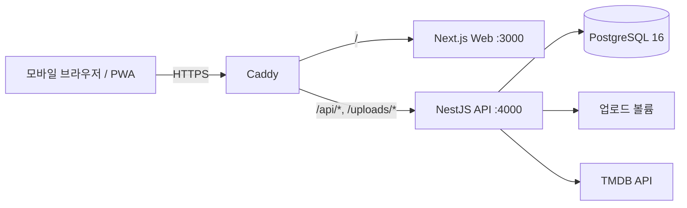

# Davas 개발 가이드

로컬 실행부터 코드 구조, 데이터베이스, 검증 명령까지 개발에 필요한 내용을 한곳에 모은 문서다. 제품 방향은 [제품 기준 문서](product/README.md), 운영 서버 절차는 [운영 가이드](operations.md)를 따른다. 실제 동작의 최종 근거는 코드, migration, package script, Compose·Caddy 설정이다.

## 1. 준비물

- Node.js 24 (Docker 이미지와 같은 버전), npm 10 이상
- Docker Engine과 Compose plugin
- TMDB API 키 (실제 작품 검색을 확인할 때만)

```bash
npm ci
```

저장소에 커밋된 `package-lock.json`과 npm만 사용한다.

## 2. 로컬 실행

### A. Docker Compose로 전체 실행

```bash
npm run docker:up      # 빌드 후 백그라운드 실행
npm run docker:logs
npm run docker:down
```

| 대상 | 주소 |
|---|---|
| Web | <http://localhost:3000> |
| API | <http://localhost:4000/api> (상태 확인: `/api/health`) |
| Swagger | <http://localhost:4000/api/docs> (개발 환경에서만 열림) |
| PostgreSQL | `localhost:5432` |

> **데이터 삭제 주의:** `docker compose down -v`는 로컬 PostgreSQL과 업로드 볼륨을 영구 삭제한다. 깨끗한 DB가 꼭 필요할 때만 쓴다.

로컬 Compose는 운영과 같은 방식으로 이미지를 빌드하지만 `TYPEORM_SYNC=true`, `NODE_ENV=development`로 실행한다. 운영 migration 리허설 용도가 아니다.

### B. Web·API는 직접, PostgreSQL만 Docker로

```bash
cp apps/api/.env.example apps/api/.env
cp apps/web/.env.example apps/web/.env.local
docker compose up -d db
npm run dev            # API와 Web을 함께 실행 (npm run dev:api / dev:web 로 따로 실행 가능)
```

Windows PowerShell에서는 `cp` 대신 `Copy-Item`을 쓴다.

### 환경 변수

| 파일 | 주요 값 |
|---|---|
| `apps/api/.env` | `DB_*`, `JWT_ACCESS_SECRET`(32자 이상), `CORS_ORIGINS=http://localhost:3000`, `COOKIE_SECURE=false`, `SWAGGER_ENABLED`, `TMDB_API_KEY` |
| `apps/web/.env.local` | `NEXT_PUBLIC_API_BASE_URL=http://localhost:4000/api` |
| `.env.production` | 운영 Compose 전용. 절대 커밋하지 않는다 ([운영 가이드](operations.md#2-최초-설정)) |

`TMDB_API_KEY`가 없어도 앱은 시작하지만 작품 검색·상세·가용성 요청은 설정 오류를 반환한다. 브라우저는 TMDB를 직접 호출하지 않는다.

## 3. 코드 지도

### 실행 구조



로컬 Compose에는 Caddy가 없고 Web·API 포트를 직접 연다.

### 저장소 구조

```text
apps/web/          Next.js App Router PWA
apps/api/          NestJS API, TypeORM entity·migration, API 테스트
packages/shared/   API와 Web이 함께 쓰는 타입·상수 (@davas/shared)
deploy/            운영 Caddyfile, 백업 스크립트
scripts/           테스트 실행기와 검증 스크립트 (npm run verify 가 사용)
docs/              이 문서들
graphify-out/      Graphify 코드 그래프 (도구가 생성, 손으로 수정하지 않음)
```

### Web 화면

하단 탭은 홈(`/`), 기록하기(`/records/new`), 내 기록(`/me`), 친구(`/friends`) 네 개이고, 설정(`/settings`)은 헤더 아이콘으로 연다.

| 경로 | 역할 |
|---|---|
| `/` | 친구 기록 피드와 추천 작품 |
| `/records/new` | 작품 찾기 → 기록 작성 (`?step=find`, `?mediaId=`) |
| `/records/:id`, `/records/:id/edit` | 감상 상세(참여자·개인 반응 포함), 수정 |
| `/search?scope=friends` 또는 `/search?scope=mine` | 기록 검색 |
| `/me` | 내 기록 |
| `/friends`, `/friends/invite/:token` | 친구 목록·요청·초대 |
| `/spaces`, `/spaces/invite/:token` | 공유 공간: 기록 타임라인과 함께 고르기(그룹 추천, `?view=recommend`), 멤버·초대 관리. 공간 초대 |
| `/settings` | 프로필·사진, 로그아웃, 법률 문서, 계정 삭제(30일 유예) |
| `/login`, `/signup` | 로그인, 초대 코드·친구 초대 가입 |
| `/terms`, `/privacy`, `/offline` | 법률 문서, PWA 오프라인 안내 |

예전 경로(`/diary`, `/community`, `/feed`, `/watchlist`, `/profile`, `/explore`)는 새 화면으로 돌려보낸다. 자세한 내용과 알려진 문제는 [부록](appendix.md#1-레거시-호환과-알려진-문제)에 있다.

주요 Web 코드:

- `src/components/core/`: 공통 화면 틀(`CoreUi.tsx`), 기록 작성(`RecordComposer.tsx`), 목록·검색(`RecordScreens.tsx`), 감상 상세(`WatchEventDetailScreen.tsx`)
- `src/components/spaces/`: 공간 화면(`SpacesScreen.tsx`), 타임라인, 그룹 추천 패널(`GroupRecommendationPanel.tsx`). 홈의 "함께 고르기"가 `/spaces?view=recommend`로 연결된다.
- `src/components/friends/`, `settings/`
- `src/lib/api/`: API 호출 함수. 공통 호출기 `core.ts`의 `coreFetch`가 401이면 임시저장을 지우고 로그인 화면으로 보낸다.
- `src/lib/core-routes.ts`: 로그인 후 돌아갈 수 있는 경로의 허용 목록
- `src/middleware.ts`: 로그인 필요 경로 검사와 예전 경로 전환

### API 모듈

모든 경로는 `/api` 아래에 있다. 새 계약은 `/api/v1`에 추가한다.

| 모듈 | 책임 |
|---|---|
| `auth`, `invites` | 로그인·가입·로그아웃, 가입 초대 코드, 쿠키 세션 |
| `users` | 프로필, 프로필 사진 업로드, 데이터 내보내기, 탈퇴 신청(30일 유예)·복구 |
| `friends` | 친구 요청·목록·검색, 일회성 친구 초대 토큰 |
| `spaces` | 2~5명 공유 공간, 공간 초대, 소유권 이전·탈퇴·종료 (`/v1/spaces`, `/v1/invites`) |
| `diaries` | 감상 기록(`/diaries`)과 감상 사건·참여자·개인 반응(`/v1/watch-events`), 공간 타임라인 |
| `media` | TMDB 검색·상세·인물 검색, 작품 선택(서버가 TMDB 원본 저장), 시청 가능성(`/media/:id/availability`) |
| `recommendations` | 오늘의 추천·장르 추천, 그룹 추천 세션과 피드백(`/v1/recommendation-sessions`) |
| `notifications` | 알림 목록과 알림 설정 |
| `outbox` | 트랜잭션 아웃박스 저장 (소비 워커는 아직 없음) |
| `watchlist`, `reactions`, `comments`, `community` | 예전 기능. 데이터·API 호환을 위해 유지 |

공간에 묶인 데이터는 반드시 `SpaceAccessService`(공간)와 `DiaryAccessService`(기록) 권한 경계를 거친다. 권한이 없는 리소스는 존재 여부가 드러나지 않게 404로 응답한다.

### 공유 계약

API와 Web이 같은 의미로 쓰는 타입·상수는 `packages/shared/src/index.ts`(TO-BE 도메인 타입)와 `contracts.ts`(기록·작품 응답 계약)에 둔다. 공유 타입을 바꾸면 `npm run build --workspace @davas/shared` 후 API·Web을 함께 검증한다.

## 4. API 보안 경계

| 장치 | 동작 | 위치 |
|---|---|---|
| 기본 로그인 요구 | 모든 경로가 `davas_access_token` 쿠키를 요구. 공개 경로만 `@Public()`. 공개지만 로그인 사용자를 구분해야 하면 `OptionalJwtCookieAuthGuard` 추가 | `auth/jwt-cookie-auth.guard.ts`, 공개 목록 테스트 `common/core-runtime-surface.spec.ts` |
| 컨트롤러 규칙 | 호출자는 `request.user`(`AuthenticatedRequest`)로만 읽는다. 컨트롤러에서 쿠키를 직접 읽거나 `AuthService`를 부르지 않는다 | `auth/controller-auth-policy.spec.ts` |
| 출처 검사 | POST·PATCH·DELETE 요청의 `Origin`이 `CORS_ORIGINS`와 다르면 403 | `common/app-security.ts` |
| 요청 횟수 제한 | 클라이언트 IP별 분당 300회 기본, 로그인 5분 10회, 검색·TMDB 별도 한도. 운영은 Caddy 한 단계만 신뢰해 실제 IP로 계산 | `common/request-limits.ts`, `TRUST_PROXY_HOPS` |
| 업로드 | 로그인 확인 후 파일 수신, 5MB 상한, 파일 내용으로 이미지 형식 확인, 동시 업로드 제한, 교체·삭제 시 이전 파일 정리 | `users/profile-image-upload.ts` |
| 작품 저장 | 브라우저는 공급자 ID만 보내고 제목·이미지는 서버가 TMDB에서 받아 저장 | `media/media-selection.service.ts` |
| 응답·설정 | 보안 헤더(Helmet, 운영은 Caddy가 최종), `Cache-Control: private, no-store`, 운영에서 Swagger 끔, 필수 설정이 없으면 운영 API가 시작을 거부 | `main.ts`, `common/app-security.ts` |
| 로그인 후 이동 | `returnTo`는 허용 목록 경로만 사용. 새 화면을 추가하면 목록도 갱신 | `apps/web/src/lib/core-routes.ts` |

## 5. 데이터베이스와 migration

- 로컬은 `TYPEORM_SYNC=true`로 entity 기준 자동 동기화를 쓸 수 있다. 버려도 되는 로컬 데이터에서만 쓴다.
- 운영은 항상 `TYPEORM_SYNC=false`이고, 빌드된 API의 migration만 사용한다.
- 스키마 변경은 새 migration으로만 추가한다. 이미 적용됐을 수 있는 migration은 수정하지 않는다.
- 새 migration의 timestamp는 `1720671100000`보다 커야 한다.
- `1720670700000`~`1720671100000` 구간은 두 작업 줄기가 같은 숫자를 썼다. 해당 10개 class 이름은 운영 기록과 이름으로 맞물려 있으므로 절대 바꾸지 않는다([부록](appendix.md#1-레거시-호환과-알려진-문제)).

```bash
# 개발용 (TypeScript 소스 기준)
npm run migration:show:src --workspace @davas/api
npm run migration:run:src --workspace @davas/api
npm run migration:revert:src --workspace @davas/api

# 운영과 같은 방식 (빌드된 dist 기준) 리허설: TYPEORM_SYNC=false로 설정 후
npm run build --workspace @davas/api
npm run migration:show --workspace @davas/api
npm run migration:run --workspace @davas/api
npm run migration:show --workspace @davas/api
```

기록 계약 요약:

- 영화·드라마 구분은 작품(`MOVIE`/`TV`)에, 시청 방식(`THEATER`/`OTT` 등)은 기록마다 저장한다.
- 감상 사건(`/v1/watch-events`)의 별점은 미평가 또는 0.5~5.0(0.5 단위)이다. 예전 `/diaries` API는 1~5 정수 별점을 유지한다.
- `clientRequestId`로 같은 생성 요청의 중복 저장을 막는다. 같은 키에 다른 내용이면 충돌로 거부한다.
- 친구 피드는 `sharedAt`이 있는 기록만 보여 준다. 비공개가 아닌 기록은 저장할 때 `sharedAt`이 채워진다.

## 6. 검증

변경 범위에 맞는 가장 작은 검사부터 실행하고, 여러 workspace에 걸친 변경이면 전체 검사를 실행한다.

```bash
npm run test:api        # 또는 test:web, test:shared
npm run lint --workspace @davas/api
npm test                # 전체 테스트
npm run verify          # 전체 점검 (아래 표 순서)
npm run verify:release  # verify + Caddy 헤더 검사 + 운영 의존성 감사
```

| 단계 | 명령 | 확인하는 것 | 확인하지 못하는 것 |
|---|---|---|---|
| 포맷 | `npm run format:check` | 바뀐 파일의 Prettier 형식, 전 파일 LF 줄바꿈 | 동작 |
| 문서 | `npm run docs:check` | 필수 문서 존재, UTF-8, 상대 링크, 지운 문서의 재등장 | 내용의 정확성 |
| 배포 계약 | `npm run verify:deployment` | 스크립트·Dockerfile·Compose·migration 목록과 운영 가이드의 일치 | 실제 서버 상태 |
| 테스트 | `npm test` | shared·API·Web 단위·계약 테스트 | 실제 PostgreSQL·TMDB·브라우저 |
| 타입·린트 | `npm run lint` | TypeScript 타입, Web ESLint | 실행 동작 |
| 빌드 | `npm run build` | shared, API, Web 운영 빌드 | 운영 DB migration |
| 인증 경계 | `npm run verify:auth` | 빌드된 API의 공개·비공개 경로 동작 | 실제 TLS·프록시 |
| 업로드 | `npm run verify:upload` | 비로그인 401, 초과 413, 위장 파일 400, 정상 201, 과다 429 | 운영 볼륨 |
| Caddy | `npm run verify:caddy` | 실제 Caddy 컨테이너의 보안 헤더 적용 (Docker 필요) | DNS·인증서 |
| 의존성 | `npm run audit:prod` | 운영 의존성의 알려진 취약점 | 실제 악용 가능성 |

- 테스트는 `scripts/run-tests.mjs`가 파일을 찾아 Node 테스트 러너에 넘긴다. package script에 따옴표 친 `**` glob을 직접 넣지 않는다.
- 포맷 검사는 바뀐 파일만 Prettier 형식을 요구한다. 아직 정리하지 않은 기존 파일은 `scripts/prettier-baseline.json`에 해시로 등록돼 있고, 그 파일을 수정하면 함께 포맷해야 한다.
- 실제 DB·브라우저·기기가 필요한 검증은 그 환경에서 실행했을 때만 통과로 본다. 판정 기준과 수동 QA 목록은 [부록](appendix.md#2-검증-요령)에 있다.

## 7. 자주 겪는 문제

| 증상 | 확인할 것 |
|---|---|
| API가 PostgreSQL에 연결하지 못함 | `docker compose ps`, `docker compose logs db`. 직접 실행 시 `DB_HOST=localhost`, Compose 안에서는 `DB_HOST=db` |
| API가 시작하자마자 종료 | `NODE_ENV=production`이면 `CORS_ORIGINS`, 32자 이상 `JWT_ACCESS_SECRET`, `COOKIE_SECURE=true`가 필수 |
| 작품 검색 실패 | `TMDB_API_KEY` 설정 여부 |
| 로그인 후 브라우저 요청이 403 | 요청 출처가 `CORS_ORIGINS`에 정확히 들어 있는지 |
| migration 명령이 `ECONNREFUSED` | DB가 떠 있지 않은 환경 문제. migration 자체 실패로 판단하지 않는다 |
| 테스트 파일을 못 찾음 | 따옴표 glob 대신 `npm test` 사용 |
| Windows에서 테스트 실행기가 `spawnSync npm ENOENT` | 최신 `scripts/run-tests.mjs` 사용 (Windows에서는 셸로 npm을 실행) |
