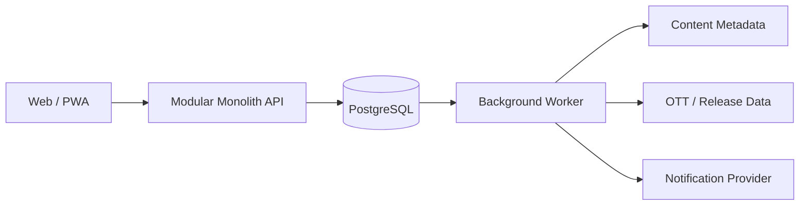

# Davas 제품 기준 문서

> 상태: 목표 제품 기준
>
> 초기 사용 시나리오: 연인 두 명
>
> 지원할 공유 공간: 2~5명

이 문서는 Davas의 제품 요구사항, 핵심 데이터 구조, 추천 원칙과 구현 순서를 정의하는 단일 기준 문서다. 현재 구현과 차이가 생기면 코드와 테스트를 확인해 작업 범위를 정하고, 합의된 제품 방향이 바뀌면 이 문서를 먼저 갱신한다.

상세한 TO-BE 설계는 다음 문서로 나눈다. 상세 문서가 이 문서와 충돌하면 이 문서를 우선한다.

- [제품 요구사항](planning/product-requirements-analysis.md)
- [기술 아키텍처](planning/technical-architecture-analysis.md)
- [추천 전략](planning/recommendation-strategy-analysis.md)
- [구현 추적표](implementation-coverage.md)

## 1. 제품 목표

Davas는 가까운 사람들이 영화와 드라마 감상을 기록·공유하고, 다음에 함께 볼 작품을 고르는 서비스다.

핵심 가치는 세 가지다.

1. 무엇을 언제, 어디서, 누구와 봤는지 기억한다.
2. 같은 작품에 대한 구성원별 별점과 리뷰를 함께 본다.
3. 지금 실제로 볼 수 있는 작품 중 참여자 모두가 만족할 후보를 찾는다.

## 2. 제품 원칙

- 기록과 별점·리뷰의 소유자는 작성자다.
- 같은 작품을 함께 봐도 별점과 리뷰는 각자 남긴다.
- 공유 여부와 공유 공간은 기록마다 명확하게 선택한다.
- 새 공간에 과거 개인 기록을 자동 공개하지 않는다.
- 한 사람의 입력만으로 다른 사람의 시청 기록을 확정하지 않는다.
- 제품 UI는 2~5명에 단순하게 맞추고, 데이터 모델에 연인이나 커플을 고정하지 않는다.
- 추천은 인기보다 시청 가능 여부와 참여자별 최소 만족도를 우선한다.

## 3. MVP

### 포함

#### 계정과 공간

- 가입, 로그인, 로그아웃, 프로필
- 정원 2~5명의 비공개 공유 공간
- 만료되는 초대 링크 생성, 수락, 거절, 취소
- 공간 생성 직후에는 소유자 1명 상태 허용
- 구성원 탈퇴와 공간 종료

#### 작품과 감상 기록

- 영화·드라마 검색과 작품 상세
- 같은 작품의 반복 감상 기록
- 필수 입력: 작품, 감상일
- 선택 입력: 별점, 리뷰, 시청 방식, 장소·OTT, 함께 본 사람, 공유 범위
- 별점: 미평가 또는 0.5~5.0, 0.5 단위
- 시청 방식: 극장, OTT, TV·소장본, 기타
- 작성자 본인의 기록 수정·삭제

#### 공유 경험

- 공간에 공유된 기록 타임라인
- 작품별 구성원 별점과 리뷰 비교
- 함께 본 감상에 대한 참여 요청, 확인, 거절
- 초대와 참여 요청 알림

#### 추천

- 이번 추천에 참여할 공간 구성원 2~5명 선택
- 지역, 이용 가능한 OTT, 영화·드라마, 러닝타임과 분위기 반영
- 이미 본 작품, 명시적 불호와 시청 불가능한 작품 제외
- 추천 이유, 이용 가능한 OTT 또는 극장 공개 상태 표시
- 관심 있음, 관심 없음, 이미 봄, 가용성 오류 피드백
- 기본은 참여자 전원 동의, 필요하면 최소 동의 인원 설정

#### 개인정보

- 개인 데이터 내보내기
- 계정 삭제와 복구 유예
- 탈퇴 즉시 다른 구성원의 비공개·공유 데이터 접근 차단
- 삭제 요청에 따른 리뷰, 위치성 텍스트와 추천 신호 삭제

### 제외

- 공개 소셜 피드, 팔로워, 댓글, 채팅
- 6명 이상 그룹과 복잡한 관리자 권한
- 에피소드별 진도와 회차별 리뷰
- OTT 결제, 티켓 구매와 영상 재생
- GPS와 정밀 위치 자동 수집
- 대규모 협업 필터링과 고급 통계

## 4. 핵심 흐름

### 공간 시작

1. 사용자가 계정을 만들고 공간을 생성한다.
2. 최대 정원 안에서 다른 사용자를 초대한다.
3. 초대받은 사용자가 공간과 공유 범위를 확인한 뒤 수락한다.
4. 각 구성원이 이용 중인 OTT와 기본 공개 범위를 설정한다.

### 감상 기록

1. 작품을 검색한다.
2. 감상일과 선택 정보를 입력한다.
3. 비공개 또는 공유할 공간을 확인하고 저장한다.
4. 함께 본 사람을 지정했다면 상대의 확인을 기다린다.
5. 확인한 참여자들은 같은 감상 건에 각자의 별점과 리뷰를 남긴다.

### 함께 볼 작품 선택

1. 공간에서 이번 추천 참여자를 고른다.
2. OTT, 시간, 유형, 분위기와 제외 조건을 설정한다.
3. 시스템이 실제 시청 가능한 후보를 먼저 거른다.
4. 참여자별 취향을 결합해 목록과 추천 이유를 제공한다.
5. 개별 관심 표시는 숨기고 합의 조건을 충족하면 매치로 알린다.
6. 시청 후 각자의 평가를 다음 추천에 반영한다.

## 5. 도메인 모델

| 모델 | 책임 |
|---|---|
| `Account` | 개인 계정과 데이터 생명주기 |
| `Space` | 2~5명이 기록을 공유하는 경계 |
| `Membership` | 사용자와 공간의 관계, 역할과 가입 상태 |
| `Invite` | 만료·취소 가능한 일회성 공간 초대 |
| `ContentTitle` | 공급자와 무관한 영화·드라마 표준 작품 |
| `WatchEvent` | 언제, 어디서, 어떤 방식으로 봤는지에 대한 감상 사실 |
| `WatchParticipant` | 감상 참여자와 확인 상태 |
| `Reaction` | 한 사용자의 별점과 리뷰 |
| `WatchSource` | 감상 당시 장소·극장·OTT 정보 |
| `AvailabilityObservation` | 현재 지역·시점의 OTT·극장 가용성 |
| `RecommendationSession` | 추천 참여자, 조건과 합의 방식 |
| `RecommendationExposure` | 노출 후보, 순위, 이유와 피드백 |

반드시 구분해야 하는 데이터는 다음과 같다.

- `WatchEvent`는 함께 본 사실이고 `Reaction`은 개인 의견이다.
- `WatchSource`는 감상 당시 정보이고 `AvailabilityObservation`은 현재 정보다.
- 공간 전체 구성원과 한 번의 감상·추천에 참여하는 구성원은 다를 수 있다.

### 핵심 제약

- 공간의 활성 구성원은 최대 5명이다.
- 5명인 공간의 추가 초대 수락은 트랜잭션 안에서 거부한다.
- 다른 사람의 참여는 `pending`, `confirmed`, `declined` 상태로 관리한다.
- 별점과 리뷰는 작성자만 수정·삭제한다.
- 기록은 같은 작품이라도 감상 시점별로 여러 개 생성할 수 있다.
- 초대 토큰과 복구 토큰은 원문이 아닌 해시로 저장한다.
- 충돌 가능한 쓰기는 버전과 멱등 키로 보호한다.

## 6. 권한과 데이터 생명주기

열람 권한은 다음 조건을 모두 만족할 때만 허용한다.

1. 계정이 활성 상태이고 차단 관계가 아니다.
2. 조회 시점에 해당 공간의 활성 구성원이다.
3. 상위 감상 건과 작성자가 선택한 공개 범위에 포함된다.

추가 규칙:

- 초대 대기 사용자는 기존 공간 데이터를 볼 수 없다.
- 탈퇴자는 즉시 공간 타임라인과 다른 구성원 반응을 볼 수 없다.
- 개인 반응과 개인 기록은 탈퇴 후에도 작성자에게 남는다.
- 공동 감상 사실을 보존하더라도 탈퇴자의 리뷰·별점·위치성 기여는 다른 구성원에게 노출하지 않는다.
- 계정 삭제는 로그인 차단, 복구 유예, 비동기 영구 삭제 순서로 처리한다.
- 권한이 없는 리소스는 존재 여부가 드러나지 않게 응답한다.

## 7. 추천 원칙

추천은 아래 순서로 처리한다.

1. 지역, OTT, 공개 상태, 유형, 시간과 회피 조건으로 후보를 필터링한다.
2. 참여자별 명시적 선호와 작품 특성으로 개인 만족도를 계산한다.
3. 가장 낮은 만족도, 평균과 참여자 간 편차를 결합한다.
4. 같은 장르·배우·프랜차이즈의 반복을 줄인다.
5. 최종 가용성을 다시 확인하고 검증 가능한 이유만 표시한다.
6. 노출과 피드백을 기록한다.

참여자가 `n`명이고 각자의 보정된 만족 예측이 `pᵢ`라면 초기 그룹 점수는 다음 형태로 시작한다.

```text
mean       = sum(pᵢ) / n
floor      = min(pᵢ)
dispersion = standardDeviation(pᵢ)

groupScore = λ * floor + (1 - λ) * mean - γ * dispersion
```

- `λ`는 0.5~0.7에서 시작해 가장 낮은 만족도를 보호한다.
- 어느 참여자든 명시적으로 거절한 작품은 기본적으로 제외한다.
- 데이터가 없는 사용자는 불호가 아니라 불확실한 상태로 처리한다.
- 가입 직후에는 각자 8~12개의 대표 작품에 선호를 표시하게 한다.
- 전체 사용자 풀이 충분히 커지기 전에는 협업 필터링을 도입하지 않는다.
- 추천 이유에는 실제 계산 근거와 가용성 확인 시점만 사용한다.

핵심 품질 지표는 하드 조건 위반 0건, 가용성 정확도, 참여자 중 최저 만족도, 합의 도달률과 선택까지 걸린 시간이다.

## 8. 기술 방향

초기 구성은 웹 또는 PWA, 모듈러 모놀리스 API, PostgreSQL과 백그라운드 워커로 한다.



애플리케이션 내부 모듈:

- Identity & Access
- Spaces & Membership
- Catalog
- Viewing Journal
- Recommendation
- Notifications
- Provider Integrations

초기에는 마이크로서비스, Kafka와 별도 추천 인프라를 두지 않는다. 비동기 작업은 PostgreSQL 작업 큐와 트랜잭션 아웃박스로 시작한다.

외부 작품·가용성 공급자는 어댑터로 격리한다. 내부 기록은 `ContentTitle`의 내부 ID만 참조하고, 공급자 ID·출처·조회 시각·만료 시각을 별도로 저장한다. `제공처 없음`과 `조회 실패`도 구분한다.

## 9. 구현 순서

### 0. 정책과 공급자 검증

- 기본 공개 범위
- 탈퇴·공간 종료 후 공동 감상 보존 범위
- 계정 삭제 복구 유예 기간
- 한국 기준 작품·OTT 데이터 공급자와 이용 조건

완료 기준: 정책 결정과 공급자 선택을 ADR로 남긴다.

### 1. 계정과 공간

- 인증, 세션, 프로필
- 공간, 멤버십과 초대 상태
- 중앙 권한 검사
- 1명·2명·5명·6명 정원 경계 테스트

완료 기준: 2~5명이 초대로 연결되고 비멤버·탈퇴자는 공간 데이터를 볼 수 없다.

### 2. 카탈로그와 감상 기록

- 작품 검색과 내부 작품 ID
- 감상 건, 참여 확인, 장소·OTT
- 개인 별점·리뷰, 반복 감상과 공유 범위

완료 기준: 영화와 드라마를 검색·기록·수정·삭제할 수 있고 외부 공급자 장애 중에도 기존 기록을 읽을 수 있다.

### 3. 공유 경험

- 공간 타임라인
- 작품별 반응 비교
- 함께 본 참여 확인과 알림
- 탈퇴·공간 종료 처리

완료 기준: 여러 사용자가 같은 감상 건에 각자 반응을 남기고 허용된 데이터만 볼 수 있다.

### 4. 추천 MVP

- OTT·공개 상태 동기화
- 초기 선호 입력과 추천 조건
- 하드 필터, 개인 점수와 그룹 점수
- 추천 이유, 합의와 피드백

완료 기준: 시청 불가능·이미 본·명시적 불호 작품이 제외되고 모든 추천에 근거와 시청 위치가 표시된다.

### 5. 운영과 비공개 베타

- 데이터 내보내기와 영구 삭제
- 백업·복구, 워커 재시도와 관측성
- 2~5명 실제 공간의 반복 사용 검증

완료 기준: 데이터 생명주기와 장애 복구 테스트를 통과하고 치명적인 권한·데이터 오류가 없다.

## 10. 후속 범위

핵심 사용 흐름이 검증된 뒤 다음 순서로 확장한다.

1. 친구 관계와 특정 친구 대상 공유
2. 한 사용자의 복수 공간 참여
3. 6명 이상 그룹과 고급 역할
4. 에피소드 단위 기록과 통계
5. 충분한 사용자 데이터가 생긴 뒤 하이브리드 협업 추천
6. 신고·차단·운영 도구가 준비된 뒤 공개 탐색

## 11. 출시 전 체크

- [ ] 공개 범위와 탈퇴·삭제 정책이 확정됐다.
- [ ] 한국 기준 작품·OTT 공급자의 정확도와 이용 조건을 검증했다.
- [ ] 공간 정원과 권한 매트릭스가 자동화 테스트를 통과한다.
- [ ] 한 감상 건에 여러 사용자가 독립적인 반응을 남길 수 있다.
- [ ] 현재 가용성과 감상 당시 시청 수단이 분리되어 있다.
- [ ] 추천 하드 조건 위반과 비공개 선호 노출이 없다.
- [ ] 데이터 내보내기, 삭제와 백업 복구를 검증했다.
