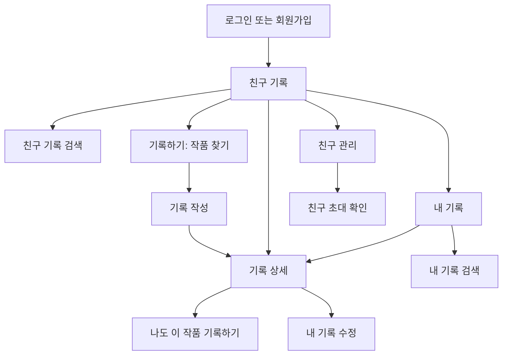

# Davas 핵심 경험 전면 재설계안

- 문서 상태: 구현 가능 설계 확정안
- 작성일: 2026-07-12
- 대상: Next.js 모바일 웹 + NestJS API
- 핵심 가치: 친한 사람들끼리 봤던 영화·드라마의 기록과 리뷰를 공유한다.

## 1. 결론

Davas를 공개형 콘텐츠 커뮤니티가 아니라 **서로 친구로 연결된 사람들의 비공개 감상 기록장**으로 재정의한다.

사용자가 앱에서 하는 핵심 행동은 세 가지뿐이다.

1. 친구가 남긴 최신 기록을 본다.
2. 내가 본 작품을 찾아 짧게 기록한다.
3. 함께 볼 친구를 초대하거나 관리한다.

하단 내비게이션은 `친구 기록`, `기록하기`, `내 기록`, `친구` 네 개로 제한한다. 추천, 인기 순위, 공개 커뮤니티, 찜, 통계, 캘린더, 반응, 댓글 등 핵심 흐름을 흐리는 기능은 화면에서 제외한다.

## 2. 설계 전제와 용어

### 2.1 두 분류 축은 반드시 분리한다

`영화/드라마`와 `영화관/OTT`는 같은 종류의 정보가 아니다.

| 구분 | 사용자에게 보이는 말 | 저장 위치 | 값 |
| --- | --- | --- | --- |
| 작품 종류 | 영화 / 드라마 | 작품 `Media` | `MOVIE` / `TV` |
| 실제로 본 곳 | 영화관 / OTT | 감상 기록 `Diary` | `THEATER` / `OTT` |

한 영화는 영화관에서도 보고 OTT에서도 다시 볼 수 있다. 따라서 `영화관/OTT`를 작품 태그로 저장하면 안 되고, 사용자가 남기는 **각 기록의 필수 속성**으로 저장해야 한다.

이 문서에서 `영화관/OTT`는 현재 상영·제공 여부가 아니라 **사용자가 실제로 본 경로**를 뜻한다. 현재 제공처 데이터는 시점과 공급자에 따라 달라지고 현재 코드에도 신뢰 가능한 제공처 계약이 없으므로 MVP에서 추정하지 않는다.

- 작품 찾기 화면에서는 `영화/드라마` 필터와 `영화관/OTT` 기록 선택을 동시에 보여준다.
- 친구 기록·내 기록 검색에서는 두 축을 저장된 값으로 실제 AND 필터링한다.
- 나중에 제공처 검색이 필요해지면 `availabilityChannel`을 별도 필드와 데이터 소스로 추가한다. `viewingMethod`를 재사용하지 않는다.

### 2.2 공유 경계

MVP의 공유 경계는 **서로 수락한 친구 전체**다.

- 새 기록은 기본적으로 친구에게 보인다.
- 사용자는 기록별로 `친구에게 보여주기`를 끄고 나만 볼 수 있다.
- 특정 친구 선택, 공개 게시, 팔로우, 여러 모임, 모임 관리자 역할은 만들지 않는다.
- 과거 `SELECTED` 기록은 새로 만들 수 없지만 기존 선택 대상에게는 계속 읽기 가능해야 한다.
- 서버는 기존 `DiaryAccessService`와 동등한 수준으로 소유자·친구 관계·공개 범위를 매 요청에서 검사한다.

별도 모임 구조를 만들지 않는 이유는 모임 생성, 멤버 역할, 전환, 탈퇴 정책을 추가하지 않고도 “친한 사람끼리”라는 가치를 가장 짧게 달성하기 위해서다.

### 2.3 제품 언어

사용자 화면에서는 기술 용어를 쓰지 않는다.

| 사용하지 않는 말 | 사용하는 말 |
| --- | --- |
| 콘텐츠 타입 | 작품 종류 |
| 미디어 | 작품 |
| 플랫폼 / 채널 | 본 곳 |
| 피드 | 친구 기록 |
| 다이어리 | 기록 |
| visibility | 친구에게 보여주기 |
| submit | 기록 저장하기 / 친구와 공유하기 |

## 3. MVP 범위

### 포함

- 로그인, 초대 코드 기반 회원가입, 로그아웃
- 친구 초대 링크, 친구 요청 수락·거절·삭제
- 친구의 최신 기록
- 영화·드라마 제목 검색
- 작품 종류 `전체/영화/드라마` 구분
- 본 곳 `영화관/OTT` 선택과 기록 검색 필터
- 기록 작성·수정·삭제
- 본 날짜, 선택적 별점, 선택적 짧은 리뷰, 스포일러 가리기
- 내 기록 목록과 검색
- 닉네임·프로필 사진 설정
- 로딩, 빈 상태, 오류, 오프라인, 접근 거부 처리

### 제외

- 공개 커뮤니티와 공개 프로필
- 추천 작품, 인기 순위, 인물 검색
- 좋아요, 이모지 반응, 댓글, 채팅, 알림함
- 찜, 보고 싶은 목록, 즐겨찾기
- 캘린더, 장르 비율, 통계, 연말 결산
- 태그, 기분, 같이 본 사람, 사진, 별도 기록 제목
- 영화관 지점명, OTT 서비스명
- 회차·시즌별 드라마 기록
- 출연진·스틸컷·줄거리 중심의 별도 작품 상세 화면과 모달
- 특정 친구에게만 공유하기
- 제공처 링크, 예매, 재생 기능
- 오프라인 신규 기록 동기화

제외 기능의 기존 테이블과 API는 1차 구현에서 파괴적으로 삭제하지 않는다. 새 IA에서 노출하지 않고 후속 정리 작업으로 분리한다.

## 4. 정보 구조와 라우트

### 4.1 하단 내비게이션

| 순서 | 라벨 | 라우트 | 역할 |
| --- | --- | --- | --- |
| 1 | 친구 기록 | `/` | 친구가 공유한 최신 기록 열람 |
| 2 | 기록하기 | `/records/new` | 작품 찾기부터 기록 시작 |
| 3 | 내 기록 | `/me` | 내가 남긴 전체 기록 열람·검색 |
| 4 | 친구 | `/friends` | 초대, 요청, 친구 목록 관리 |

프로필 아바타는 `/settings`로 이동한다. 햄버거 메뉴와 중복 내비게이션은 제거한다.

### 4.2 전체 라우트

```text
/login                         로그인
/signup                        회원가입
/friends/invite/:token         친구 초대 확인
/terms                         이용약관, 공개 route
/privacy                       개인정보처리방침, 공개 route

/                              친구 기록
/search?scope=friends          친구 기록 검색
/records/new                   작품 찾기 + 기록 작성 2단계
/records/:id                   기록 상세
/records/:id/edit              기록 수정
/me                            내 기록
/search?scope=mine             내 기록 검색
/friends                       친구 관리
/settings                      프로필·계정 설정
/offline                       오프라인 안내
```

기존 `/explore`, `/feed`, `/diary`, `/community`, `/watchlist`, 세부 프로필 라우트는 새 화면으로 리디렉션하거나 내비게이션에서 제거한다. 기존 화면 구성을 새 설계의 근거로 재사용하지 않는다.

### 4.3 화면 관계



## 5. 핵심 사용자 흐름

### 5.1 첫 기록 남기기

```text
친구 기록의 ‘본 작품 기록하기’
→ 본 곳 선택(영화관/OTT)
→ 제목 입력
→ 작품 종류 선택(전체/영화/드라마)
→ 작품 선택
→ 날짜 확인
→ 별점·리뷰를 선택적으로 입력
→ 친구와 공유하기
→ 저장 완료 안내 후 새 기록 상세
```

작품 검색 결과에서 저장 완료까지 화면 전환은 최대 2회로 제한한다.

### 5.2 친구 기록 찾기

```text
친구 기록의 검색창
→ 제목 또는 친구 닉네임 입력
→ 작품 종류와 본 곳 필터 선택
→ 결과 카드
→ 기록 상세
```

두 필터는 AND로 결합한다. 예를 들어 `영화 + OTT`는 친구가 OTT로 본 영화 기록만 보여준다.

### 5.3 같은 작품 기록하기

```text
친구 기록 카드 또는 상세의 ‘나도 기록하기’
→ 작품이 미리 선택된 기록 작성
→ 사용자가 본 곳과 날짜 선택
→ 저장
```

친구가 선택한 본 곳은 참고 배지로만 보여주고 내 기록 값으로 자동 확정하지 않는다.

### 5.4 친구 초대

```text
친구
→ 친구 초대하기
→ 링크 복사 또는 기기 공유
→ 상대가 초대 확인
→ 로그인 또는 회원가입 후 수락
→ 서로의 친구 공개 기록 열람 가능
```

초대 링크를 만든 행위와 상대가 수락한 행위를 두 사람의 동의로 본다. 만료·이미 사용·본인 링크 상태를 각각 설명한다.

## 6. 공통 레이아웃과 디자인 표준

기존의 화면 배치는 재사용하지 않지만 현재 실사용 디자인의 톤은 유지한다. 레거시 `davas-*` 회갈색·뉴모피즘 초안보다 실제 컴포넌트에서 사용하는 밝은 회청색·화이트 카드·블루·coral 조합을 기준으로 한다.

### 6.1 시각 방향

> 밝고 부드러운 모바일 감상 기록장. 회청색 캔버스 위 흰 카드, 깊은 네이비 글자, 신뢰감 있는 파란 상호작용, 기록 완료 순간만 coral로 강조한다. 큰 라운드와 약한 그림자로 친근하지만 유아적이지 않게 표현한다.

### 6.2 토큰

| 용도 | 값 |
| --- | --- |
| 앱 배경 | `#F6F8FC` |
| 데스크톱 바깥 배경 | `#EEF2F7` |
| 카드 | `#FFFFFF` |
| 보조 카드 | `#F6F9FD` |
| 본문 | `#1F2A44` |
| 제목 | `#23426F` |
| 보조 글자 | `#65758A` |
| 비활성·장식 글자 | `#8B96A8`, 의미 있는 문구에는 사용 금지 |
| 상호작용·선택 | `#216BD8` |
| 선택 배경 | `#EAF1FF` |
| warm accent | `#FF5A52`, 별점·장식 전용 |
| 기록 완료 CTA | `#D83B35` 위 `#FFFFFF` |
| 위험 배경 / 글자 | `#FFF1F0` / `#A93530` |
| 경계선 | `#DCE5EF` 또는 `#EDF1F7` |
| 카드 그림자 | `0 10px 26px rgba(31, 65, 114, 0.075)` |

deep coral `#D83B35`는 저장·가입처럼 되돌리기 전 마지막 행동에만 사용한다. 밝은 coral `#FF5A52`는 별점·장식에만 쓴다. 탐색, 선택, 재시도는 blue 또는 navy를 사용한다. 한 화면에 coral 주요 버튼을 두 개 이상 두지 않는다.

흰 카드 위 의미 있는 본문·placeholder·보조 정보는 최소 `#65758A`를 사용한다. `#8B96A8`은 disabled 또는 장식 정보에만 허용한다. 일반 크기 텍스트와 CTA는 배경 대비 4.5:1 이상이어야 한다.

### 6.3 타이포와 간격

- 서체: `Pretendard Variable`, Pretendard, system sans-serif
- 페이지 제목: 22px / 800~900 / 28px line-height
- 섹션 제목: 17px / 800 / 24px
- 카드 제목: 15px / 700~800 / 21px
- 본문·입력: 최소 14px / 500~700 / 22px
- 보조 정보: 최소 12px / 600 / 18px
- 기본 4px 그리드
- 화면 좌우 여백: 16px, 390px 이상 20px
- 카드 내부 여백: 16px
- 섹션 간격: 24px
- 작은 요소 간격: 8~12px

기존 화면의 10~11px 메타 글자는 비전문 사용자 가독성을 위해 새 핵심 화면에서는 12px 미만으로 사용하지 않는다.

### 6.4 모양과 동작

- 콘텐츠 최대 폭 430px, 중앙 정렬
- 고정 헤더 64px, 로고와 설정 아바타만 배치
- 하단 내비게이션은 safe-area 포함, 항목 터치 영역 최소 56px
- 입력 48~52px, radius 15~22px
- 카드 radius 22~24px
- 칩과 분할 버튼 radius full 또는 14px
- 모든 터치 목표 최소 44×44px
- `:focus-visible` 3px `#216BD8`, 3px offset
- 전환 160~220ms, `prefers-reduced-motion`에서는 제거
- 색만으로 상태를 전달하지 않고 `영화`, `드라마`, `영화관`, `OTT` 텍스트를 항상 표시

### 6.5 모바일 골격

```text
┌────────────────────────────┐
│ [Davas 로고]        [아바타] │  64px 고정 헤더
├────────────────────────────┤
│ 화면 제목                    │
│ 설명 또는 검색               │
│                            │
│ 흰색 라운드 카드             │
│ 흰색 라운드 카드             │
│                            │
├────────────────────────────┤
│ 친구 기록  기록하기  내 기록  친구 │  고정 하단 내비게이션
└────────────────────────────┘
```

검수 폭은 360px, 390px, 430px로 한다. 640px 이상에서도 앱 콘텐츠 폭은 430px를 유지하고 바깥 배경만 노출한다.

## 7. 공통 컴포넌트

| 컴포넌트 | 기능 규칙 |
| --- | --- |
| `CoreAppShell` | 430px 셸, 헤더, 네 탭, safe-area를 한 곳에서 관리 |
| `CoreHeader` | 로고, 설정 아바타. 햄버거와 중복 링크 없음 |
| `BackHeader` | 뒤로가기, 현재 화면 제목. 하위 작업 화면에서 안전 fallback route 제공 |
| `CoreBottomNav` | 네 라벨과 아이콘, 현재 위치 텍스트·색·indicator로 표시 |
| `SearchField` | 52px, 지우기 버튼, 제출·입력 중 상태, 명시적 label |
| `MediaTypeControl` | `전체/영화/드라마`; 항상 펼쳐진 분할 버튼 |
| `ViewingMethodControl` | `전체/영화관/OTT` 또는 작성용 `영화관/OTT`; 텍스트 필수 |
| `RecordCard` | 작성자, 작품, 두 분류 배지, 날짜, 별점, 리뷰 미리보기 |
| `MediaResultCard` | 포스터, 제목, 연도, 작품 종류, 선택 CTA |
| `RatingField` | `별점 안 남김`과 1~5점 radio; 키보드 조작 가능 |
| `SpoilerCover` | 사용자가 `내용 보기`를 누르기 전 본문을 렌더링하지 않음 |
| `EmptyState` | 이유 한 문장 + 다음 행동 한 개 또는 최대 두 개 |
| `AsyncState` | 고정 높이 스켈레톤, 오류 설명, 같은 자리의 재시도 |
| `ConfirmSheet` | 삭제·작성 취소·친구 삭제에만 사용; 취소를 안전 기본값으로 |
| `Toast` | 저장·복사 성공처럼 다음 행동을 막지 않는 피드백에만 사용 |

### 7.1 화면별 앱 chrome

| 화면 | 상단 | 하단 nav | 뒤로가기 fallback |
| --- | --- | --- | --- |
| 친구 기록, 작품 찾기 1단계, 내 기록, 친구 | `CoreHeader` | 표시, 해당 탭 active | 해당 없음 |
| 기록 작성 2단계 | `BackHeader` | 숨김 | 작품 찾기 1단계 |
| 친구·내 기록 검색 | `BackHeader` | 숨김 | scope가 friends면 `/`, mine이면 `/me` |
| 기록 상세 | `BackHeader` | 숨김 | 안전한 `returnTo`, 없으면 내 기록은 `/me`, 친구 기록은 `/` |
| 기록 수정 | `BackHeader` | 숨김 | 해당 기록 상세 |
| 설정 | `BackHeader` | 숨김 | `/` |
| 친구 초대 확인 | `BackHeader` | 숨김 | 로그인 상태면 `/friends`, 비로그인이면 `/login` |
| 오프라인·403·404·5xx | `BackHeader` 또는 상태 제목 | 숨김 | 브라우저 history가 없으면 `/` |
| 로그인·회원가입 | 인증 전용 header | 숨김 | 상호 auth 화면 또는 안전한 returnTo |

`returnTo`는 앱 내부 허용 route만 받는다. 기록 작성 2단계의 뒤로가기는 draft 폐기 확인 규칙을 먼저 적용한다.

## 8. 전체 화면 기능 명세

| ID | 화면 | 주요 행동 | 완료 결과 |
| --- | --- | --- | --- |
| AUTH-01 | 로그인 | 로그인 | 원래 목적지 또는 친구 기록 |
| AUTH-02 | 회원가입 | 계정 만들기 | 초대 확인 또는 첫 기록 |
| FEED-01 | 친구 기록 | 기록 읽기·기록 시작 | 상세 또는 작품 찾기 |
| FIND-01 | 작품 찾기 | 본 곳·종류·작품 선택 | 기록 작성 2단계 |
| WRITE-01 | 기록 작성·수정 | 공유·저장 | 실제 기록 상세 |
| DETAIL-01 | 기록 상세 | 읽기·나도 기록·내 기록 관리 | 작성 또는 이전 목록 |
| SEARCH-01 | 기록 검색 | 두 축 필터·결과 선택 | 기록 상세 |
| MINE-01 | 내 기록 | 내 기록 찾기 | 기록 상세 |
| FRIEND-01 | 친구 | 초대·요청·삭제 | 친구 관계 갱신 |
| INVITE-01 | 초대 확인 | 친구 연결 | 친구 기록 |
| SETTINGS-01 | 설정 | 프로필 저장·계정 행동 | 현재 화면 또는 로그인 |
| LEGAL-01 | 약관·개인정보 | 공식 문서 읽기 | 이전 화면 |
| SYSTEM-01 | 공통 상태 | 재시도·안전한 이동 | 원래 흐름 복귀 |

별도 작품 상세 화면은 만들지 않는다. 검색 결과의 포스터·제목·원제·연도로 작품을 구분하고, 선택 후 작성 화면 상단의 작품 요약과 `작품 바꾸기`로 잘못 선택한 경우를 복구한다.

### AUTH-01 로그인 `/login`

**목적**  기존 사용자가 한 번에 서비스로 들어간다.

**구성**

1. Davas 로고
2. `친구들과 본 작품을 기록하고 나눠보세요.` 한 문장
3. 이메일, 비밀번호
4. 비밀번호 보기
5. 주요 버튼 `로그인`
6. 보조 링크 `계정 만들기`

**동작과 상태**

- 제출 중 필드를 잠그고 버튼을 `로그인 중…`으로 바꾼다.
- 인증 실패는 폼 위가 아니라 관련 입력 아래 또는 제출 버튼 바로 위에 쉬운 문장으로 표시한다.
- 로그인 후 원래 접근하려던 초대 또는 기록 URL이 있으면 그곳으로, 아니면 `/`로 이동한다.
- 이미 로그인한 사용자는 `/`로 이동한다.

### AUTH-02 회원가입 `/signup`

**목적**  초대받은 사용자가 최소 정보로 계정을 만든다.

**구성**

1. 초대 코드 입력·확인
2. 확인 성공 후 닉네임, 이메일, 비밀번호, 비밀번호 확인
3. 필수 약관 동의
4. 주요 버튼 `계정 만들기`
5. 보조 링크 `로그인하기`

**동작과 상태**

- 친구 초대 URL에서 들어오면 가입 초대와 친구 초대 토큰을 유지한다.
- 일반 `/signup` 진입은 기존 가입 초대 코드를 확인한 뒤 계정 입력을 펼친다.
- 유효한 친구 초대 URL에서 진입하면 그 친구 token 자체를 별도의 가입 자격으로 검증하고 가입 초대 코드 입력은 생략한다. 두 token의 entity와 수명 주기는 합치지 않는다.
- 닉네임은 2~20자, 리뷰 카드에서 그대로 보인다는 설명을 제공한다.
- friendInviteToken으로 가입하면 계정 생성·친구 연결·token 소비를 한 transaction에서 완료하고 `/`로 이동한다. 일반 가입이면 `/records/new`로 이동한다.

### FEED-01 친구 기록 `/`

**목적**  가까운 사람들이 무엇을 보고 어떻게 느꼈는지 최신순으로 본다.

**구성 순서**

1. 페이지 제목 `친구 기록`
2. 탭 가능한 검색 필드 `작품이나 친구 이름으로 기록 찾기`
3. 전체 폭 주요 카드 `본 작품 기록하기`
4. `최근 공유된 기록` 목록
5. 하단 네 탭

**기록 카드**

- 친구 아바타와 닉네임
- `7월 10일에 봤어요` 형식의 본 날짜
- 포스터, 작품명, 공개·방영 연도
- `영화/드라마`와 `영화관/OTT` 텍스트 배지
- 별점이 있을 때만 `★ 4`
- 리뷰 최대 3줄
- 스포일러면 본문 대신 가림 카드
- 보조 행동 `자세히 보기`, `나도 기록하기`

**정렬과 페이지 처리**

- 친구에게 공유된 시각 `sharedAt DESC`, 동률이면 `createdAt DESC`, `id DESC`
- 첫 20개, 이후 `더 보기` 버튼 방식. 무한 스크롤만 제공하지 않는다.
- 내가 친구 공개로 남긴 기록은 중복 확인을 위해 홈에 포함하되 `내 기록` 배지를 붙인다.

**빈 상태**

- 친구가 없음: `아직 연결된 친구가 없어요.` + `친구 초대하기`
- 친구는 있으나 기록이 없음: `아직 공유된 기록이 없어요.` + `내 첫 기록 남기기`
- 네트워크 오류: 내용을 유지할 수 있으면 유지하고 상단에 `새로고침` 제공

```text
친구 기록
[ 작품이나 친구 이름으로 기록 찾기 ]
[ ＋ 본 작품 기록하기               ]

최근 공유된 기록
┌────────────────────────────┐
│ 민지 · 7월 10일에 봤어요       │
│ [포스터]  인터스텔라            │
│          [영화] [OTT]          │
│          ★ 5                  │
│          다시 봐도 마음이…      │
│ [자세히 보기]   [나도 기록하기]   │
└────────────────────────────┘
```

### FIND-01 기록하기: 작품 찾기 `/records/new` 1단계

**목적**  본 곳과 작품을 혼동 없이 선택한다.

**구성 순서**

1. 제목 `어떤 작품을 봤나요?`
2. `어디서 봤나요?` — `[영화관] [OTT]`, 기본 선택 없음
3. 검색 필드 `영화나 드라마 제목 입력`
4. `작품 종류` — `[전체] [영화] [드라마]`
5. 현재 선택 요약 `OTT로 본 드라마를 찾는 중`
6. 검색 결과 목록

`영화관/OTT` 선택은 작품의 현재 제공 여부를 필터링하는 값이 아니라 다음 단계 기록에 저장되는 값이다. 화면 아래에 `선택한 본 곳은 내 기록에 저장돼요.`를 짧게 안내한다.

**검색 규칙**

- 공백 제거 후 2자 이상에서 300ms debounce 또는 Enter로 검색한다.
- `전체 → multi`, `영화 → movie`, `드라마 → tv`를 API까지 전달한다.
- 클라이언트가 `multi` 첫 페이지를 받은 뒤 거르는 방식은 금지한다.
- 결과는 포스터, 한글 제목, 원제, 연도, `영화/드라마` 배지로 동명 작품을 구분한다.
- 결과 선택 전에 본 곳을 고르지 않았다면 첫 번째 누락 항목으로 초점을 이동하고 설명한다.
- 선택한 TMDB 결과는 기존 `POST /media/selections`를 거쳐 내부 media UUID로 변환한 뒤 2단계로 이동한다.
- 검색어, 종류, 본 곳은 뒤로 왔을 때 유지한다.

**상태**

- 초기: `본 작품의 제목을 입력해 주세요.`
- 검색 중: 포스터 비율이 유지되는 결과 스켈레톤 4개
- 없음: 검색어와 필터 요약 + `작품 종류 전체로 보기`
- 오류: 입력값 유지 + `다시 검색`
- 포스터 없음: 작품명 이니셜이 있는 공통 placeholder

```text
어떤 작품을 봤나요?

어디서 봤나요?
[ 영화관 ] [ OTT ]

[ 영화나 드라마 제목 입력        × ]
작품 종류  [전체] [영화] [드라마]

┌────────────────────────────┐
│ [포스터] 인터스텔라              │
│          Interstellar · 2014   │
│          [영화]       [선택]     │
└────────────────────────────┘
```

### WRITE-01 기록 작성·수정 `/records/new`, `/records/:id/edit` 2단계

**목적**  최소 필수 정보만으로 빠르게 기록하고 선택적으로 감상을 남긴다.

**필수 입력**

- 작품
- 본 곳 `영화관/OTT`
- 본 날짜, 기본값 Asia/Seoul 기준 오늘

**선택 입력**

- 별점: 없음 또는 1~5 정수
- 리뷰: 최대 500자
- 리뷰에 스포일러가 있을 때 `스포일러가 있어요`
- `친구에게 보여주기`, 기본 켬

**구성 순서**

1. 선택한 작품 요약과 `작품 바꾸기`
2. 본 곳 분할 버튼
3. 본 날짜
4. 별점
5. `어땠나요?` 리뷰 입력과 글자 수
6. 리뷰가 있을 때 스포일러 스위치
7. 친구 공개 스위치와 결과 설명
8. 화면 하단 고정 CTA

**버튼 문구**

- 친구 공개 켬: `친구와 공유하기`
- 친구 공개 끔: `나만 저장하기`
- 수정: `수정 내용 저장하기`

**동작과 검증**

- 별점과 리뷰를 강제하지 않는다. 빠른 기록을 막지 않는다.
- 미래 날짜는 선택할 수 없다.
- 같은 사용자·작품·날짜·본 곳 기록이 있으면 첫 create가 `409 POSSIBLE_REWATCH`와 기존 기록 요약을 반환한다. UI는 `기존 기록 보기`와 `새 기록으로 저장`을 제공하고, 두 번째 선택에서 `allowDuplicate=true`로 저장한다.
- 제출 중 버튼을 비활성화하고 POST body의 `clientRequestId`로 중복 생성을 막는다.
- 저장 실패 시 입력값과 스크롤 위치를 유지한다.
- 작성 내용은 개인정보 보호를 위해 localStorage가 아닌 sessionStorage에만 보존한다. key는 `davas:draft:{userId}:{create|edit}:{recordId|new}`로 사용자·작업을 분리하고 저장 성공, 명시적 폐기, 로그아웃, 계정 삭제 때 제거한다.
- 입력 후 뒤로 가면 `작성 중인 내용을 버릴까요?` 확인을 한 번만 표시한다.
- 친구 공개 저장 후 상세로 이동하며 `친구와 기록을 공유했어요.` toast를 보여준다. 비공개 저장은 `내 기록에 저장했어요.`라고 알린다.
- 수정 화면은 동일 컴포넌트를 재사용한다. 작품 변경은 명시적 `작품 바꾸기`를 통해서만 가능하다.
- 레거시 `SELECTED` 기록을 수정할 때는 `일부 친구 공개(이전 방식)` 안내를 보여주고 기본값으로 기존 selectedUserIds를 보존한다. 사용자가 `친구 전체로 변경` 또는 `나만 보기로 변경`을 명시적으로 선택한 경우에만 새 공개 범위로 전환한다.

### DETAIL-01 기록 상세 `/records/:id`

**목적**  한 기록의 작품 정보와 리뷰를 편하게 읽는다.

**구성 순서**

1. 작성자 아바타, 닉네임, 본 날짜
2. 포스터, 작품명, 연도
3. `영화/드라마`, `영화관/OTT` 배지
4. 선택적 별점
5. 전체 리뷰 또는 스포일러 가림
6. 친구 기록이면 `나도 이 작품 기록하기`
7. 내 기록이면 `수정`, `삭제`

**동작과 상태**

- 스포일러는 `내용 보기`를 누른 뒤 해당 방문에서만 연다.
- `나도 기록하기`는 작품만 미리 선택하고 본 곳은 사용자가 확인하게 한다.
- 삭제는 작품명과 결과를 말하는 확인 sheet 후 실행한다. 성공 후 이전 목록으로 이동한다.
- 존재 여부를 노출하지 않기 위해 기록 권한 실패와 실제 부재를 API에서 모두 404로 처리한다. 화면은 `기록을 찾을 수 없어요.`와 홈 버튼을 표시하고 원인을 추정하지 않는다.
- 댓글·반응·공개 공유 버튼은 두지 않는다.

### SEARCH-01 기록 검색 `/search?scope=friends|mine`

**목적**  친구 또는 내 기록을 같은 방식으로 빠르게 찾는다.

**구성 순서**

1. 범위에 따른 제목 `친구 기록 검색` 또는 `내 기록 검색`
2. 검색 필드 — 친구 범위 `작품 제목 또는 친구 이름`, 내 기록 범위 `작품 제목으로 내 기록 찾기`
3. `작품 종류` — `[전체] [영화] [드라마]`
4. `본 곳` — `[전체] [영화관] [OTT]`
5. 현재까지 불러온 개수와 적용 필터 요약
6. 기록 카드 목록

**검색 규칙**

- 필터 두 줄을 접거나 더보기 안에 숨기지 않는다.
- 검색어, 작품 종류, 본 곳은 AND로 결합한다.
- `scope=friends`는 접근 가능한 친구·본인의 `FRIENDS` 기록과 나에게 공유된 레거시 `SELECTED` 기록을 검색한다.
- `scope=mine`은 공개 범위와 관계없이 내 기록만 검색한다.
- 친구 범위 검색어는 `(작품 한글 제목 또는 원제 또는 작성자 닉네임) AND 두 필터`로 적용한다.
- 내 기록 범위 검색어는 `(작품 한글 제목 또는 원제) AND 두 필터`로 적용한다. 본인 닉네임은 검색 대상이 아니다.
- 두 범위 모두 리뷰 본문은 검색하지 않는다.
- URL query에 `q`, `mediaType`, `viewingMethod`, `scope`를 저장해 새로고침과 뒤로 가기를 보존한다.
- 검색어 없이 필터만 적용할 수 있다.
- 정렬은 친구 기록은 공유 시각 최신순, 내 기록은 본 날짜 최신순이다.
- 전체 개수를 별도로 계산하지 않고 `현재 20개를 불러왔어요.`처럼 응답 items의 누적 개수를 표시한다.

**빈 상태**

- 조건 없음 + 기록 없음: 범위에 맞는 첫 행동 CTA
- 검색 결과 없음: 현재 조건을 문장으로 표시하고 `필터 모두 지우기`
- 오류: 검색어와 필터를 유지하고 `다시 시도`

### MINE-01 내 기록 `/me`

**목적**  내가 남긴 기록을 공개 여부와 관계없이 관리한다.

**구성 순서**

1. 제목 `내 기록`
2. 탭 가능한 검색 필드 `내 기록 검색`
3. 전체 폭 보조 CTA `새 기록 남기기`
4. 본 날짜 최신순 기록 목록

**기록 카드 차이**

- 작성자 영역을 제거하고 `친구 공개`, `나만 보기`, 레거시 기록의 `일부 친구 공개(이전 방식)` 배지를 표시한다.
- 작품 종류, 본 곳, 본 날짜, 선택적 별점, 리뷰 미리보기를 유지한다.
- 카드 전체는 상세로 이동한다. 수정·삭제를 작은 아이콘으로 카드에 숨기지 않는다.

**빈 상태**

- `아직 남긴 기록이 없어요.`
- `본 작품 기록하기` 한 개의 주요 버튼

통계, 달력, 장르 비율, 즐겨찾기 섹션은 넣지 않는다.

### FRIEND-01 친구 `/friends`

**목적**  공유할 사람을 초대하고 연결 상태를 이해한다.

**구성 순서**

1. 제목 `친구`
2. 가장 눈에 띄는 `친구 초대하기`
3. 받은 요청, 있을 때만 상단 표시
4. 닉네임·이메일로 친구 찾기
5. 친구 목록
6. 보낸 요청, 있을 때만 접지 않고 간단히 표시

**친구 초대하기**

- 서버가 만료 시각과 1회성 token이 있는 링크를 만든다.
- Web Share API가 있으면 기기 공유 sheet, 없으면 링크 복사.
- 성공 toast는 `초대 링크를 복사했어요.`처럼 결과를 말한다.
- 링크에는 이메일, 사용자 id 같은 개인정보를 넣지 않는다.

**친구 찾기**

- 검색은 trim 후 2자 이상에서 실행하고 loading, 결과 없음, 오류를 검색 영역 안에 표시한다.
- 서버는 닉네임 또는 정확한 이메일로 찾을 수 있지만 결과에는 `id`, 닉네임, 프로필 이미지만 반환하며 이메일을 노출하지 않는다.
- 본인은 결과에서 제외한다.
- 결과 행은 관계에 따라 `친구 요청 보내기`, `요청 보냄`, `받은 요청 보기`, `이미 친구` 중 하나를 텍스트로 표시한다.
- 요청 중에는 해당 행만 비활성화하고 중복 클릭을 막는다. `받은 요청 보기`는 받은 요청 섹션으로 초점을 이동한다.

**요청과 삭제**

- 받은 요청 행에는 닉네임, `수락`, `거절`을 텍스트로 표시한다.
- 보낸 요청은 `요청 보냄`과 `취소`를 표시한다.
- 친구 삭제는 `서로의 친구 공개 기록을 더 이상 볼 수 없어요.` 확인 후 처리한다.
- 상대의 공개 프로필이나 팔로워 수로 이동하지 않는다.

**빈 상태**

- `친구를 초대하면 서로의 영화·드라마 기록을 볼 수 있어요.`
- 바로 `친구 초대하기`

### INVITE-01 친구 초대 확인 `/friends/invite/:token`

**목적**  초대한 사람과 결과를 확인하고 안전하게 친구 연결을 수락한다.

**구성**

1. 초대한 사람의 아바타와 닉네임
2. `OO님과 영화·드라마 기록을 나눌까요?`
3. 주요 버튼 `친구로 연결하기`
4. 보조 버튼 `나중에 하기`

**상태**

- 비로그인 기존 사용자: 로그인 후 동일 token으로 돌아와 accept한다.
- 비로그인 신규 사용자: `친구로 연결하기` 의사를 확인한 뒤 가입으로 이동한다. signup transaction이 계정 생성, ACCEPTED friendship 생성, token 소비를 원자적으로 완료하므로 같은 링크로 여러 계정을 만들 수 없다.
- 만료: `초대 링크가 만료됐어요.` + `새 링크 요청하기` 안내
- 이미 친구: 오류 대신 `이미 친구예요.` + `친구 기록 보기`
- 본인 링크: `내 초대 링크예요.` + `친구 화면으로 가기`
- 이미 사용: 개인정보를 드러내지 않고 만료 상태와 같은 문구

### SETTINGS-01 프로필·계정 설정 `/settings`

**목적**  공유 카드에 필요한 최소 프로필과 계정을 관리한다.

**구성**

1. 프로필 사진 선택·삭제
2. 닉네임
3. `변경 내용 저장`
4. 로그아웃
5. 약관, 개인정보처리방침
6. 위험 영역의 계정 삭제

**동작과 상태**

- 변경 사항이 없으면 저장 버튼을 비활성화한다.
- 저장 성공은 toast, 실패는 해당 폼 안에 표시한다.
- 로그아웃은 확인창 없이 실행한다.
- 계정 삭제만 비밀번호 재확인과 결과 설명을 요구한다. 성공하면 204 응답과 함께 cookie를 만료하고 로그인으로 이동한다.
- DB transaction은 내 기록·댓글을 soft delete하고, 나와 관련된 friendship·share·reaction·like·notification·follow·watchlist·favorite 행을 제거하며, companion 참조는 `탈퇴한 사용자`로 익명화하고, 활성 친구 초대를 revoke한 뒤 사용자를 익명화·soft delete한다.
- 프로필 이미지 파일 삭제는 DB transaction commit 뒤 idempotent하게 실행한다. 실패해도 계정 삭제를 되돌리거나 파일 URL을 다시 노출하지 않고, 정리 로그에 남겨 다음 유지보수 cleanup에서 재시도한다.
- 삭제된 계정의 email과 nickname은 충돌하지 않는 익명 값으로 바꿔 동일 email·nickname으로 다시 가입할 수 있게 한다. 과거 기록은 친구·내 기록·직접 URL에서 더 이상 노출하지 않는다.
- 비밀번호 오류는 삭제하지 않고 `비밀번호가 맞지 않아요.`를 같은 확인 화면에 표시한다.
- 알림, 장르 취향, 통계, 공개 프로필, 다중 설정 하위 화면은 두지 않는다.

### LEGAL-01 약관·개인정보 `/terms`, `/privacy`

**목적**  가입 전에 동의할 공식 문서와 현재 버전을 읽을 수 있게 한다.

- 두 route는 로그인 없이 열 수 있고 `BackHeader`를 사용한다.
- 법률 문구를 Codex가 임의로 작성하지 않는다. 운영자가 승인한 versioned 원문을 `apps/web/src/content/legal` 같은 단일 위치에 제공하고 화면은 그 원문만 렌더링한다.
- 공식 원문이 없으면 개발용 fixture임을 명확히 표시하고 **배포 blocker**로 보고한다. 미완성 문구를 공식 약관처럼 배포하지 않는다.
- signup은 `termsAccepted=true`, 현재 `termsVersion`, `privacyVersion`을 전송한다. 서버는 현재 버전과 일치하지 않거나 동의가 false면 가입을 거부하고 별도 `user_consents` 기록에 사용자, 두 version, 동의 시각을 저장한다.
- 설정의 링크와 가입의 링크는 반드시 같은 route와 version을 가리킨다.

### SYSTEM-01 공통 시스템 화면과 상태

| 상태 | 처리 |
| --- | --- |
| 전역 로딩 | 헤더·하단 nav는 유지하고 본문만 레이아웃 고정 스켈레톤 |
| 오프라인 | 개인정보가 있는 기록 목록을 새로 영속 cache한다고 가정하지 않는다. 현재 화면을 유지할 수 있으면 읽기 전용으로 두고, 아니면 안내 화면을 표시한다. 작성 draft는 보존하고 `연결 후 다시 시도` 제공 |
| 401 | `POST /auth/logout`으로 HttpOnly cookie를 먼저 만료하고 사용자 draft를 정리한 뒤, 현재 내부 URL을 안전한 returnTo로 보존해 로그인으로 이동 |
| 403 | 일반 권한 오류는 이유를 추정하지 않고 홈 이동 제공. 기록 상세는 존재 은닉을 위해 404 사용 |
| 404 | `기록을 찾을 수 없어요.`와 홈·내 기록 버튼 |
| 5xx | 쉬운 문장, 요청 id가 있으면 복사용 세부 정보에만 표시, 재시도 제공 |
| 포스터 누락 | 고정 비율 placeholder + 작품명 |
| reduced motion | skeleton pulse와 화면 전환 제거 |

별도 저장 완료 화면은 만들지 않는다. toast와 다음 화면의 실제 데이터 반영으로 성공을 증명한다.

## 9. 데이터·API 설계

### 9.1 공유 타입

```ts
export const VIEWING_METHODS = ['THEATER', 'OTT'] as const;
export type ViewingMethod = (typeof VIEWING_METHODS)[number];

export type MediaType = 'MOVIE' | 'TV';
```

화면 매핑은 다음 한 곳에서만 관리한다.

```text
MOVIE   → 영화
TV      → 드라마
THEATER → 영화관
OTT     → OTT
```

### 9.2 Diary 변경

| 필드 | 규칙 |
| --- | --- |
| `mediaId` | 필수, 내부 Media UUID |
| `userId` | 필수, 작성자 |
| `viewingMethod` | 신규 작성 필수 `THEATER/OTT`, 레거시 행만 null 허용 |
| `watchedDate` | 필수, 미래 불가 |
| `rating` | nullable, 값이 있으면 정수 1~5 |
| `content` | 선택, trim 후 최대 500자 |
| `hasSpoiler` | content가 있을 때만 의미 있음 |
| `visibility` | POST는 `FRIENDS/PRIVATE`만 허용, 기본 `FRIENDS`; PATCH에서 누락하면 레거시 `SELECTED` 보존 |
| `sharedAt` | 친구에게 보이기 시작한 시각. PRIVATE는 null, FRIENDS create·PRIVATE→FRIENDS 전환 때 현재 시각 |
| `title` | UI에서 받지 않고 서버가 Media 제목으로 채우는 호환 필드 |
| `clientRequestId` | 새 Web create body의 필수 UUID, DB 레거시 행만 nullable |
| `clientRequestFingerprint` | 서버가 create 정규화 payload를 SHA-256한 immutable 64자 값, DB 레거시 행만 nullable |

기존 `watchedPlace`를 `viewingMethod`로 이름만 바꿔 사용하지 않는다. 새 컬럼을 additive migration으로 추가한다.

레거시 변환은 명확한 값만 한다.

- `영화관`, `극장`이 명시된 행 → `THEATER`
- `OTT` 또는 명확한 OTT 서비스명이 있는 행 → `OTT`
- `집`, 빈 값, 기타 장소 → null 유지

기존 `FRIENDS/SELECTED` 기록의 `sharedAt`은 migration에서 `createdAt`으로 backfill하고 PRIVATE는 null로 둔다. FRIENDS→PRIVATE는 null, PRIVATE/SELECTED→FRIENDS는 전환 시각으로 갱신한다. FRIENDS 상태의 일반 편집은 sharedAt을 바꾸지 않는다.

레거시 null은 카드에 `본 곳 미입력`으로 표시하고 특정 본 곳 검색에서는 제외한다. 수정 시에는 반드시 선택하게 한다.

rating을 집계하는 기존 코드가 남아 있다면 null을 0점으로 계산하지 말고 값이 있는 기록만 대상으로 해야 한다. 리뷰가 빈 문자열이면 서버는 `hasSpoiler=false`로 정규화한다.

`UpdateDiaryDto`는 `mediaId`, `viewingMethod`, `watchedDate`, `rating`, `content`, `hasSpoiler`, `visibility`만 허용한다. `clientRequestId`, `clientRequestFingerprint`, `allowDuplicate`, `userId`, `title`은 PATCH에서 받지 않는다. mediaId를 변경하면 Media 존재를 다시 검사하고 title을 새 Media 제목으로 파생한다.

### 9.3 API 계약

기존 `/diaries` 경로는 데이터 호환을 위해 유지해도 된다. 화면 용어만 `기록`으로 통일한다.

```text
GET  /media/search?q=&type=multi|movie|tv&page=
POST /media/selections

POST   /diaries
GET    /diaries/feed?q=&mediaType=&viewingMethod=&cursor=&limit=
GET    /diaries/me?q=&mediaType=&viewingMethod=&cursor=&limit=
GET    /diaries/:id
PATCH  /diaries/:id
DELETE /diaries/:id

GET    /friends
GET    /friends/search?q=
POST   /friends/requests
PATCH  /friends/requests/:id/accept
PATCH  /friends/requests/:id/reject
DELETE /friends/requests/:id
DELETE /friends/:id

POST /friends/invites
GET  /friends/invites/:token
POST /friends/invites/:token/accept

DELETE /users/me                  body { password }, 성공 204
```

**목록 응답 envelope**

```ts
type CursorPage<T> = {
  items: T[];
  nextCursor: string | null;
  hasMore: boolean;
};
```

- 기본 limit은 20, 최대 50이다.
- cursor는 클라이언트가 해석하지 않는 opaque 문자열이다.
- feed와 friends 검색은 `(sharedAt DESC, createdAt DESC, id DESC)` tuple을 사용한다.
- me와 mine 검색은 `(watchedDate DESC, createdAt DESC, id DESC)` tuple을 사용한다.
- `hasMore=false`면 `더 보기`를 제거한다. 더 보기 실패 시 기존 items를 유지한다.
- 작품 찾기는 TMDB의 `page/totalPages`를 유지하고 `다음 결과 보기`로 다음 page를 같은 검색어·종류에서 이어 붙인다.

**필수 서버 규칙**

- media type 필터는 TMDB 요청까지 전달한다.
- feed/me의 `mediaType`, `viewingMethod`는 서버에서 AND 처리한다. q는 feed에서 작품 제목·원제·작성자 닉네임을 OR 검색한 뒤 필터와 AND하고, me에서는 작품 제목·원제만 OR 검색한 뒤 필터와 AND한다.
- feed는 수락된 친구와 본인의 `FRIENDS` 기록, 현재 사용자에게 지정된 레거시 `SELECTED` 기록만 반환한다.
- me는 본인의 `FRIENDS/PRIVATE/SELECTED` 기록을 모두 반환한다.
- record detail은 UI 노출 여부와 무관하게 서버에서 권한을 검사한다.
- 기록 접근 권한 실패는 실제 부재와 동일한 404 error shape를 반환해 존재 여부를 숨긴다.
- create는 `viewingMethod`를 필수로 검증하고 title을 Media에서 파생한다.
- create의 visibility는 서버에서도 FRIENDS/PRIVATE만 허용하고 새 SELECTED create를 거부한다. PATCH에서 visibility와 selectedUserIds가 모두 누락되면 기존 SELECTED와 shares를 보존하고, FRIENDS/PRIVATE로 명시 변경할 때만 기존 shares를 제거한다.
- visibility 전환 규칙에 따라 sharedAt을 서버가 설정·초기화하고 클라이언트 입력은 받지 않는다.
- create/update는 미래 watchedDate를 거부하고 빈 리뷰의 hasSpoiler를 false로 정규화한다.
- create는 semantic duplicate 검사보다 먼저 `clientRequestId` 기존 행을 조회한다. body의 필수 `clientRequestId`와 `(userId, clientRequestId)` unique index로 중복 생성을 방지한다. 서버가 `mediaId/viewingMethod/watchedDate/rating/trim content/normalized hasSpoiler/visibility`를 정규화해 SHA-256 `clientRequestFingerprint`를 저장하며 `clientRequestId/allowDuplicate`는 hash에서 제외한다. 같은 key·fingerprint 재시도는 기존 기록과 `deduplicated=true`를 반환하고, 같은 key·다른 fingerprint는 `409 IDEMPOTENCY_CONFLICT`를 반환한다. fingerprint는 PATCH에서 절대 변경하지 않으며 unique race도 같은 규칙으로 복구한다.
- 같은 mediaId·watchedDate·viewingMethod의 기존 기록은 `allowDuplicate`가 없을 때 `409 POSSIBLE_REWATCH`로 알려주고, `allowDuplicate=true`일 때 새 기록을 허용한다.
- 친구 초대 token은 해시 저장, 만료, 1회 사용, 본인 수락 방지를 적용한다. accept와 friend-token signup은 DB row lock 또는 조건부 update로 한 요청만 성공하게 한다.
- 회원가입은 기존 `inviteCode` 또는 유효한 `friendInviteToken` 중 하나를 받는다. friend token은 기존 가입 코드 테이블로 복사하지 않는다. friend-token signup은 user, ACCEPTED friendship, token의 `usedAt/usedByUserId`를 한 transaction에서 생성·갱신하며 실패 시 전부 rollback한다.

### 9.4 응답 카드 최소 계약

```ts
type RecordCardDto = {
  id: string;
  author: { id: string; nickname: string; profileImageUrl: string | null };
  media: {
    id: string;
    title: string;
    originalTitle: string | null;
    posterUrl: string | null;
    releaseYear: string | null;
    mediaType: 'MOVIE' | 'TV';
  };
  viewingMethod: 'THEATER' | 'OTT' | null;
  watchedDate: string;
  rating: number | null;
  reviewPreview: string | null;
  hasSpoiler: boolean;
  visibility: 'FRIENDS' | 'PRIVATE' | 'SELECTED';
  sharedAt: string | null;
  createdAt: string;
  isMine: boolean;
};
```

목록 응답과 상세 응답이 서로 다른 라벨을 만들지 않도록 raw enum을 보내고 Web의 공통 formatter에서만 한글화한다.

목록 응답은 `hasSpoiler=true`이거나 리뷰가 비어 있으면 반드시 `reviewPreview=null`을 반환하고 스포일러 원문을 payload에 포함하지 않는다. 일반 리뷰만 trim한 미리보기를 반환한다.

**create/detail/error 응답**

```ts
type CreateDiaryResponse = {
  diary: DiaryDetailDto;
  deduplicated: boolean;
};

type DiaryDetailDto = RecordCardDto & {
  content: string;
  updatedAt: string;
};

type ApiErrorDto = {
  statusCode: number;
  code: string;
  message: string;
  details?: Record<string, unknown>;
};
```

- 신규 create는 201과 `deduplicated=false`, 동일 요청 replay는 200과 `deduplicated=true`를 반환한다.
- `POSSIBLE_REWATCH`는 409와 다음 details를 반환한다. Web은 message 문자열을 파싱하지 않고 code로 분기한다.

```json
{
  "statusCode": 409,
  "code": "POSSIBLE_REWATCH",
  "message": "이미 같은 조건의 기록이 있어요.",
  "details": {
    "existingRecord": {
      "id": "uuid",
      "mediaTitle": "인터스텔라",
      "watchedDate": "2026-07-12",
      "viewingMethod": "OTT"
    }
  }
}
```

- `IDEMPOTENCY_CONFLICT`는 409, 기록 권한 실패·부재는 공통 `RECORD_NOT_FOUND` 404를 반환한다.
- 상세 API의 `content`는 전체 리뷰다. Web은 `hasSpoiler=true`이면 사용자가 열기 전 DOM에 본문을 렌더링하지 않는다.

## 10. 현재 저장소에 적용하는 경계

### 유지할 기반

- Next.js App Router의 얇은 `page.tsx` + 기능별 `components` 구조
- 430px 모바일 셸과 Pretendard 전역 스타일
- 기존 인증 쿠키와 middleware 보호 방식
- TMDB 검색과 `media/selections` 내부 UUID 변환 흐름
- NestJS validation pipe, TypeORM, additive migration 원칙
- 서버의 친구 관계와 기록 접근 제어

### 교체할 화면 구조

- 5개 하단 탭 → 4개 핵심 탭
- drawer 메뉴 → 제거
- 홈 대시보드 → 친구 최신 기록
- 탐색·추천 → 기록용 작품 찾기
- 다이어리 대시보드·통계 → 단순 내 기록
- 커뮤니티 → 친구 기록으로 통합
- 여러 프로필 하위 화면 → 단일 설정 화면

### 구현상 주의

- `useMediaSearch`가 `multi` 결과를 받은 뒤 클라이언트에서 거르지 않고 `type`을 API까지 전달해야 한다.
- `tags`는 현재 영속화되지 않으므로 본 곳 저장에 사용하면 안 된다.
- 기존 migration 파일을 수정하지 않고 새 migration을 추가한다.
- 기존 추천·watchlist·reaction 등의 API와 테이블은 1차에서 삭제하지 않는다.
- 기존 정규식 기반 디자인 테스트는 새 IA 계약으로 함께 교체한다.
- 사용자가 이미 수정한 다른 파일을 덮거나 되돌리지 않는다.

## 11. 접근성·문구·상태 규칙

- 모든 입력에는 보이는 label 또는 정확한 accessible name이 있어야 한다.
- chip은 `button` 또는 radio group으로 만들고 `aria-pressed`/checked 상태를 노출한다.
- 별점은 포인터뿐 아니라 Tab, 화살표, 숫자 키로 조작할 수 있다.
- 포스터 alt는 목록에서 작품명, 장식용 중복 이미지는 빈 alt를 사용한다.
- 오류 발생 시 초점을 오류 요약 또는 첫 오류 필드로 이동한다.
- 리뷰 500자 제한은 입력 중 남은 글자와 초과 이유를 표시한다.
- `저장`, `확인` 같은 모호한 버튼보다 `친구와 공유하기`, `친구 요청 수락`처럼 결과를 쓴다.
- disabled 버튼만으로 이유를 전달하지 않고 바로 위에 누락 항목을 말한다.
- 날짜는 저장은 ISO `YYYY-MM-DD`, 화면은 `2026년 7월 12일` 또는 `7월 12일`로 표시한다.

## 12. 수용 기준

### 분류·검색

- [ ] 작품 찾기에서 `전체/영화/드라마`와 `영화관/OTT`가 같은 화면에 항상 보인다.
- [ ] 영화 선택은 `type=movie`, 드라마 선택은 `type=tv`로 API와 TMDB까지 전달된다.
- [ ] 기록 검색에서 작품 종류와 본 곳이 AND로 동작한다.
- [ ] 모든 기록 카드와 상세가 두 분류를 텍스트로 표시한다.
- [ ] 같은 작품을 영화관과 OTT로 각각 기록할 수 있다.
- [ ] 제공처 정보가 없을 때 영화관 또는 OTT라고 추정하지 않는다.

### 핵심 흐름

- [ ] 로그인한 사용자가 홈에서 한 번의 명시적 행동으로 기록을 시작한다.
- [ ] 필수 입력은 작품, 본 곳, 본 날짜 세 개뿐이다.
- [ ] 별점과 리뷰 없이도 기록할 수 있다.
- [ ] 저장 실패 후 작성 내용이 그대로 남는다.
- [ ] draft는 사용자별 sessionStorage에만 남고 저장·폐기·로그아웃·탈퇴 때 제거된다.
- [ ] 친구 기록에서 같은 작품 기록을 바로 시작할 수 있다.
- [ ] 친구가 아닌 사용자는 친구 공개 기록을 직접 URL로도 볼 수 없다.

### 단순성

- [ ] 하단 탭은 네 개다.
- [ ] 핵심 행동을 hamburger, 점 세 개, 숨은 filter drawer에 넣지 않는다.
- [ ] 공개 커뮤니티, 추천, 통계, 찜, 반응, 댓글이 새 IA에 노출되지 않는다.
- [ ] 한 화면의 강조 CTA는 하나다.

### 품질

- [ ] 360px, 390px, 430px에서 가로 스크롤과 하단 CTA 가림이 없다.
- [ ] 모든 상호작용의 터치 영역이 최소 44px다.
- [ ] 주요 텍스트, placeholder, CTA의 색 대비가 WCAG AA 4.5:1 이상이다.
- [ ] 키보드만으로 로그인, 필터, 작품 선택, 별점, 저장이 가능하다.
- [ ] 만료된 cookie로 로그인과 홈이 반복 이동하지 않는다.
- [ ] reduced motion 환경에서 필수 정보 손실이 없다.
- [ ] 새 API·Web 테스트, lint, production build가 통과한다.

## 13. UX 검증 시나리오

IT 비숙련 사용자 5명에게 설명 없이 아래 작업을 요청한다.

1. OTT로 본 드라마를 찾아 별점 없이 기록한다.
2. 친구가 영화관에서 본 영화 기록을 찾는다.
3. 스포일러가 있는 리뷰를 열어 본다.
4. 같은 작품을 `나도 기록하기`로 시작한다.
5. 친구 한 명을 초대한다.

성공 기준은 5명 중 최소 4명이 각 작업을 도움 없이 완료하고, 첫 기록 저장까지 중앙값 90초 이내인 것이다. 실패 지점은 기능 추가보다 라벨, 순서, 기본값을 먼저 수정한다.

## 14. 구현 완료 정의

다음 조건이 모두 충족되어야 “설계 적용 완료”로 본다.

1. 새 네 탭 IA와 모든 화면 상태가 실제 데이터로 동작한다.
2. `viewingMethod`가 migration, entity, DTO, service, 응답, Web form과 card를 왕복한다.
3. 영화·드라마 필터가 서버 검색에 연결된다.
4. 친구·내 기록의 두 축 검색이 서버 권한 안에서 동작한다.
5. 레거시 null 기록과 기존 인증 데이터가 깨지지 않는다.
6. 제외 기능이 새 내비게이션과 핵심 화면에 노출되지 않는다.
7. 테스트, lint, build와 세 모바일 폭 수동 QA 결과가 기록된다.
