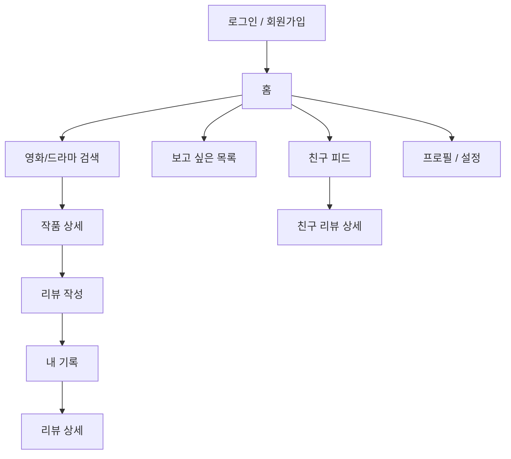
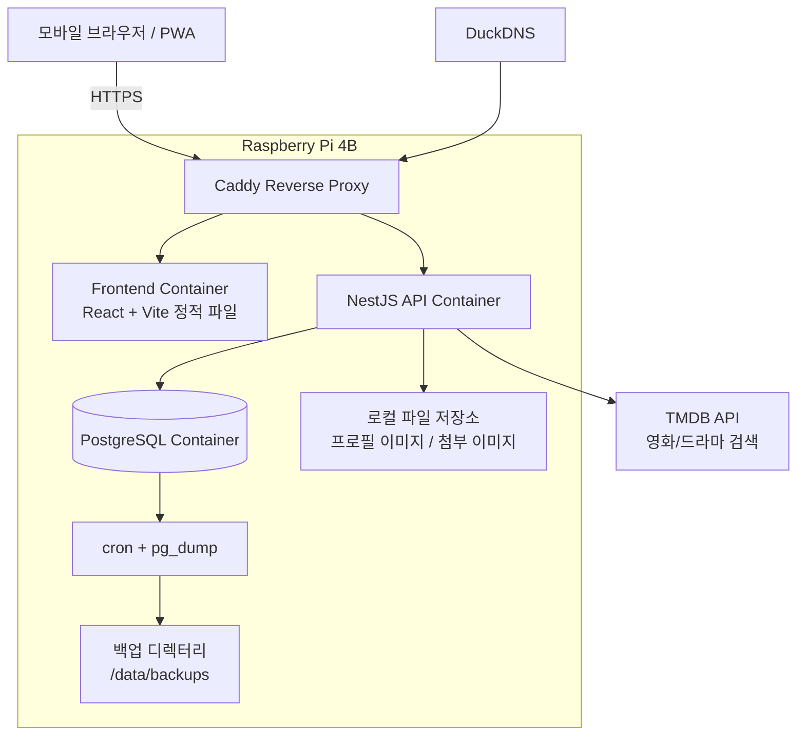
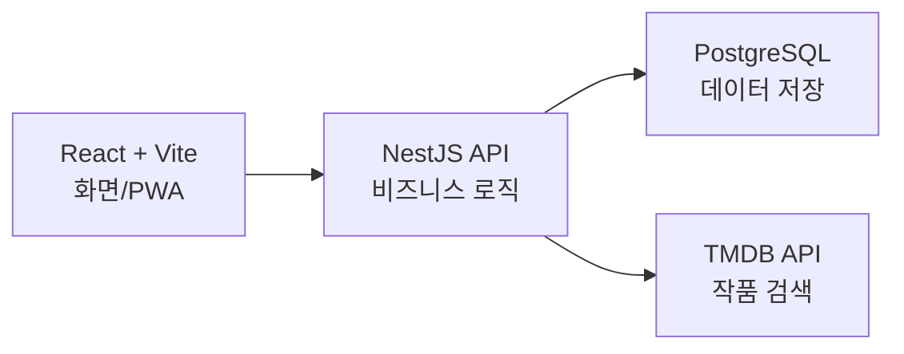
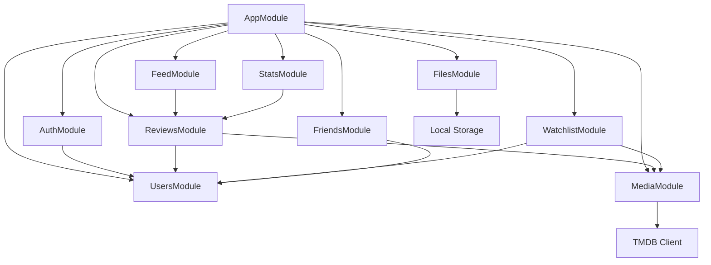
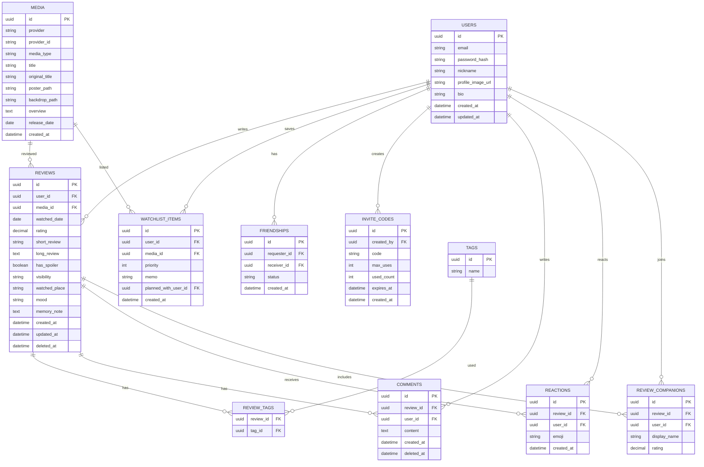

# Davas 모바일 우선 PWA 자가 호스팅 설계서

**작성일:** 2026-07-09  
**제품 유형:** 영화/드라마 감상 기록장  
**핵심 방향:** 모바일 우선 PWA + 소규모 초대제 기록장  
**운영 전제:** Raspberry Pi 4B 자가 호스팅  

---

## 1. 결론

Davas는 대규모 공개 SNS가 아니라 가까운 사람끼리 영화와 드라마 감상 경험을 남기는 **소규모 초대제 기록장**으로 설계한다.

핵심 플로우는 다음 하나다.

```text
영화/드라마 검색 -> 작품 선택 -> 감상 기록 작성 -> 내 기록 축적 -> 가까운 사람과 공유
```

기술 스택은 Raspberry Pi 4B 자가 호스팅을 전제로 다음 조합을 목표로 한다.

| 영역 | 최종 권장 |
| --- | --- |
| Frontend | React + Vite + TypeScript + PWA |
| UI | Tailwind CSS + shadcn/ui 또는 DaisyUI |
| Backend | NestJS + TypeScript |
| DB | PostgreSQL |
| ORM | Prisma |
| Auth | 자체 JWT 인증 + bcrypt 또는 argon2 |
| 영화/드라마 검색 | TMDB API |
| 파일 저장 | Raspberry Pi 로컬 볼륨 |
| 배포 | Docker Compose |
| Reverse Proxy | Caddy |
| 외부 접근 | DuckDNS + Caddy HTTPS |
| 백업 | cron + pg_dump |

기존 초안의 `Next.js + Supabase + Vercel` 조합은 관리형 클라우드 배포에는 적합하지만, 현재 목표가 Raspberry Pi 자가 호스팅이면 `React + Vite + NestJS + PostgreSQL` 조합이 더 단순하고 운영 비용도 낮다.

---

## 2. 제품 원칙

### 2.1 만들지 않을 것

| 제외 방향 | 이유 |
| --- | --- |
| 대규모 공개 SNS | 가까운 사람과의 기록/회고 경험이 흐려진다. |
| 실시간 채팅 | 핵심 가치와 거리가 있고 운영 부담이 커진다. |
| 자체 영화 DB 구축 | 포스터, 줄거리, 출연진 등 메타데이터 확보 비용이 크다. |
| 복잡한 MSA 구조 | Raspberry Pi 1대와 소규모 사용자에는 과하다. |
| 공개 추천 알고리즘 중심 서비스 | 기록장이 아니라 콘텐츠 플랫폼처럼 변한다. |

### 2.2 지킬 것

| 원칙 | 설명 |
| --- | --- |
| 모바일 우선 | 실제 사용은 모바일 브라우저/PWA가 중심이다. |
| 초대제 | 불특정 다수 가입보다 가까운 사용자만 받는다. |
| 기록 우선 | 피드보다 감상 기록 작성과 회고가 먼저다. |
| 같이 본 기록 | 이 앱의 차별점은 "누구와, 어디서, 어떤 분위기로 봤는가"다. |
| 낮은 운영 부담 | Raspberry Pi에서 Docker Compose로 관리 가능해야 한다. |

---

## 3. 핵심 사용자 가치

1. 사용자는 영화/드라마를 검색해 정확한 작품을 선택하고 감상 기록을 남길 수 있다.
2. 사용자는 감상 날짜, 평점, 한줄평, 긴 리뷰, 스포일러 여부를 구조화해서 저장할 수 있다.
3. 사용자는 같이 본 사람, 장소, 분위기, 추억 메모를 남겨 개인적인 회고 자료로 쓸 수 있다.
4. 사용자는 보고 싶은 작품을 따로 저장하고 나중에 봤음으로 전환할 수 있다.
5. 사용자는 가까운 친구의 최근 리뷰를 피드에서 보고 댓글이나 이모지로 반응할 수 있다.
6. 사용자는 공개 범위를 정해 나만 보기, 친구 공개, 특정 사람 공개를 선택할 수 있다.

---

## 4. 기능 범위

### 4.1 1차 MVP 포함

| 구분 | 기능 |
| --- | --- |
| 인증 | 회원가입, 로그인, 초대 코드 입력, JWT 기반 세션 |
| 작품 검색 | TMDB 영화/드라마 통합 검색 |
| 작품 상세 | 포스터, 제목, 원제, 줄거리, 장르, 개봉/방영일 |
| 기록 작성 | 별점, 감상일, 한줄평, 긴 리뷰, 스포일러 여부 |
| 같이 본 기록 | 같이 본 사람, 감상 장소, 분위기, 추억 메모 |
| 내 기록 | 리뷰 목록, 리뷰 상세, 수정, 삭제 |
| 보고 싶은 목록 | 추가, 삭제, 우선순위, 봤음 처리 |
| 친구 기능 | 친구 초대 코드, 친구 목록, 친구 피드 |
| 반응 | 댓글, 이모지 반응 |
| 프로필 | 닉네임, 프로필 이미지, 선호 장르, 로그아웃 |

### 4.2 2차 이후

| 기능 | 설명 |
| --- | --- |
| 통계 | 월별 감상 수, 평균 평점, 장르 분포, 같이 본 사람별 기록 |
| 컬렉션 | "극장에서 본 것", "2026 여름", "넷플릭스에서 본 것" 같은 묶음 |
| 추천 후보 투표 | 다음에 볼 작품 후보를 올리고 함께 고르기 |
| 데이터 내보내기 | CSV 또는 Markdown 백업 |
| 관리자 화면 | 초대 코드, 사용자, 숨김 리뷰, 메타데이터 캐시 관리 |
| 푸시 알림 | PWA push 또는 추후 Android wrapper 연동 |

### 4.3 1차에서 제외

| 제외 | 이유 |
| --- | --- |
| Redis | 초기 사용자 수에서는 DB만으로 충분하다. |
| Elasticsearch/Meilisearch | TMDB 검색과 PostgreSQL 검색으로 시작한다. |
| Kubernetes | Raspberry Pi 1대에는 부적합하다. |
| Grafana/Prometheus | 초기에는 health check와 로그 확인으로 충분하다. |
| MinIO/S3 | 프로필 이미지 정도는 로컬 볼륨으로 충분하다. |
| OAuth 로그인 | 초대제 소규모 서비스는 자체 로그인으로 단순화한다. |

---

## 5. 핵심 차별 기능: 같이 본 기록

일반 리뷰 앱과 Davas를 구분하는 핵심은 작품 평가보다 **함께 본 경험의 기록**이다.

| 항목 | 예시 |
| --- | --- |
| 같이 본 사람 | 여자친구, 친구 A |
| 같이 본 장소 | 집, 영화관, 여행지, 카페 |
| 감상 분위기 | 재밌음, 울었음, 지루했음, 또 보고 싶음 |
| 평점 비교 | 내 평점 4.5 / 상대 평점 3.5 |
| 추억 메모 | "이날 비 와서 집에서 봄" |

MVP에서는 같이 본 사람을 자유 입력 또는 친구 선택으로 받는다. 친구 계정과 연결된 사람은 `companions.user_id`로 연결하고, 계정이 없는 사람은 이름 문자열로 저장할 수 있게 한다.

---

## 6. 주요 화면

### 6.1 전체 화면 설계

전체 화면은 인증, 메인 탭, 작품 검색/상세, 리뷰 작성, 내 기록, 보고 싶은 목록, 친구 피드, 컬렉션, 통계, 소규모 친구 기능, 프로필/설정, 관리자/운영 영역으로 나눈다.

```mermaid
flowchart TD
    ENTRY[앱 진입] --> LOGIN_CHECK{로그인 상태?}

    LOGIN_CHECK -->|아니오| AUTH1
    LOGIN_CHECK -->|예| HOME

    subgraph AUTH_AREA[인증 화면]
        AUTH1[시작 화면]
        AUTH2[로그인]
        AUTH3[회원가입]
        AUTH4[비밀번호 재설정]
        AUTH5[초대 코드 입력]
        AUTH1 --> AUTH2
        AUTH1 --> AUTH3
        AUTH2 --> AUTH4
        AUTH3 --> AUTH5
    end

    AUTH5 --> HOME

    subgraph MAIN_AREA[메인 탭 구조]
        HOME[홈]
        SEARCH[검색]
        DIARY[내 기록]
        FEED[친구 피드]
        PROFILE[프로필]
    end

    HOME --> SEARCH
    HOME --> DIARY
    HOME --> FEED
    HOME --> PROFILE

    subgraph HOME_AREA[홈 화면]
        HOME1[오늘의 요약]
        HOME2[최근 본 작품]
        HOME3[이어쓰기 중인 리뷰]
        HOME4[보고 싶은 목록 미리보기]
        HOME5[이번 달 감상 통계]
        HOME6[추천: 다시 볼 작품 / 아직 리뷰 안 쓴 작품]
        HOME --> HOME1
        HOME --> HOME2
        HOME --> HOME3
        HOME --> HOME4
        HOME --> HOME5
        HOME --> HOME6
    end

    subgraph SEARCH_AREA[검색 화면]
        SEARCH1[영화/드라마 통합 검색]
        SEARCH2[검색 결과 목록]
        SEARCH3[작품 상세]
        SEARCH4[보고 싶은 목록에 추가]
        SEARCH5[리뷰 작성 시작]
        SEARCH6[이미 기록한 내 리뷰 보기]
        SEARCH --> SEARCH1
        SEARCH1 --> SEARCH2
        SEARCH2 --> SEARCH3
        SEARCH3 --> SEARCH4
        SEARCH3 --> SEARCH5
        SEARCH3 --> SEARCH6
    end

    subgraph MEDIA_DETAIL_AREA[작품 상세 화면]
        M1[포스터 / 제목 / 원제]
        M2[영화 or 드라마 구분]
        M3[개봉일 / 방영일]
        M4[장르]
        M5[줄거리]
        M6[출연진]
        M7[내 평균 평점]
        M8[친구들의 평점]
        M9[내 감상 기록 목록]
        SEARCH3 --> M1
        SEARCH3 --> M2
        SEARCH3 --> M3
        SEARCH3 --> M4
        SEARCH3 --> M5
        SEARCH3 --> M6
        SEARCH3 --> M7
        SEARCH3 --> M8
        SEARCH3 --> M9
    end

    subgraph REVIEW_WRITE_AREA[리뷰 작성 화면]
        R1[작품 선택 확인]
        R2[감상 날짜]
        R3[별점]
        R4[한줄평]
        R5[긴 리뷰]
        R6[스포일러 여부]
        R7[같이 본 사람]
        R8[감상 장소]
        R9[태그]
        R10[공개 범위]
        R11[저장]
        SEARCH5 --> R1
        R1 --> R2
        R2 --> R3
        R3 --> R4
        R4 --> R5
        R5 --> R6
        R6 --> R7
        R7 --> R8
        R8 --> R9
        R9 --> R10
        R10 --> R11
    end

    subgraph DIARY_AREA[내 기록 화면]
        DIARY1[전체 리뷰 목록]
        DIARY2[캘린더 보기]
        DIARY3[작품별 보기]
        DIARY4[장르별 보기]
        DIARY5[태그별 보기]
        DIARY6[컬렉션 보기]
        DIARY7[리뷰 상세]
        DIARY8[리뷰 수정]
        DIARY9[리뷰 삭제]
        DIARY --> DIARY1
        DIARY --> DIARY2
        DIARY --> DIARY3
        DIARY --> DIARY4
        DIARY --> DIARY5
        DIARY --> DIARY6
        DIARY1 --> DIARY7
        DIARY7 --> DIARY8
        DIARY7 --> DIARY9
    end

    subgraph WATCHLIST_AREA[보고 싶은 목록]
        W1[보고 싶은 작품 목록]
        W2[우선순위 설정]
        W3[OTT/시청 가능 위치 메모]
        W4[같이 볼 사람 지정]
        W5[봤음으로 전환]
        HOME4 --> W1
        SEARCH4 --> W1
        W1 --> W2
        W1 --> W3
        W1 --> W4
        W1 --> W5
        W5 --> R1
    end

    subgraph FEED_AREA[친구 피드 화면]
        F1[친구 최근 리뷰]
        F2[친구 리뷰 상세]
        F3[댓글]
        F4[이모지 반응]
        F5[스포일러 가리기]
        F6[친구 프로필 보기]
        FEED --> F1
        F1 --> F2
        F2 --> F3
        F2 --> F4
        F2 --> F5
        F2 --> F6
    end

    subgraph COLLECTION_AREA[컬렉션 화면]
        C1[내 컬렉션 목록]
        C2[컬렉션 상세]
        C3[컬렉션 생성]
        C4[컬렉션 수정]
        C5[작품 추가/제거]
        DIARY6 --> C1
        C1 --> C2
        C1 --> C3
        C2 --> C4
        C2 --> C5
    end

    subgraph STATS_AREA[통계 화면]
        S1[월별 감상 수]
        S2[평균 평점]
        S3[장르 분포]
        S4[영화/드라마 비율]
        S5[같이 본 사람별 기록]
        S6[높은 평점 작품]
        S7[낮은 평점 작품]
        HOME5 --> S1
        HOME5 --> S2
        HOME5 --> S3
        HOME5 --> S4
        HOME5 --> S5
        HOME5 --> S6
        HOME5 --> S7
    end

    subgraph SOCIAL_AREA[소규모 친구 기능]
        SO1[친구 목록]
        SO2[친구 초대]
        SO3[초대 코드 생성]
        SO4[친구 요청 수락]
        SO5[공개 범위 관리]
        SO6[차단/숨김]
        PROFILE --> SO1
        SO1 --> SO2
        SO2 --> SO3
        SO1 --> SO4
        SO1 --> SO5
        SO1 --> SO6
    end

    subgraph PROFILE_AREA[프로필/설정 화면]
        P1[내 프로필]
        P2[닉네임 수정]
        P3[프로필 이미지 수정]
        P4[선호 장르 설정]
        P5[계정 설정]
        P6[알림 설정]
        P7[데이터 내보내기]
        P8[로그아웃]
        PROFILE --> P1
        P1 --> P2
        P1 --> P3
        P1 --> P4
        PROFILE --> P5
        PROFILE --> P6
        PROFILE --> P7
        PROFILE --> P8
    end

    subgraph ADMIN_AREA[관리자/운영 화면]
        A1[사용자 목록]
        A2[초대 코드 관리]
        A3[신고/숨김 리뷰 관리]
        A4[작품 메타데이터 캐시 관리]
        A5[공지 관리]
        PROFILE --> A1
        A1 --> A2
        A1 --> A3
        A1 --> A4
        A1 --> A5
    end
```



### 6.2 MVP 화면 흐름



### 6.3 탭 구조

모바일 하단 탭은 5개를 기준으로 한다.

| 탭 | 역할 |
| --- | --- |
| 홈 | 최근 기록, 보고 싶은 목록, 빠른 검색 진입 |
| 검색 | 영화/드라마 검색과 작품 상세 진입 |
| 내 기록 | 내 리뷰 목록, 캘린더/작품별 보기로 확장 |
| 친구 피드 | 친구 리뷰, 댓글, 이모지 반응 |
| 프로필 | 내 정보, 친구, 설정, 로그아웃 |

### 6.4 화면별 구성

| 화면 | 주요 구성 |
| --- | --- |
| 홈 | 오늘의 요약, 최근 본 작품, 이어쓰기 중인 리뷰, 보고 싶은 목록 미리보기 |
| 검색 | 통합 검색창, 영화/드라마 필터, 검색 결과 카드 |
| 작품 상세 | 포스터, 제목, 줄거리, 장르, 출연진 일부, 내 기록 히스토리 |
| 리뷰 작성 | 작품 요약, 감상일, 별점, 한줄평, 긴 리뷰, 스포일러, 같이 본 기록, 공개 범위 |
| 내 기록 | 전체 목록, 검색, 정렬, 필터, 리뷰 상세 진입 |
| 보고 싶은 목록 | 우선순위, 메모, 같이 볼 사람, 봤음 전환 |
| 친구 피드 | 친구 최근 리뷰, 스포일러 가리기, 댓글, 이모지 |
| 프로필 | 닉네임, 프로필 이미지, 선호 장르, 친구 목록, 데이터 내보내기 |
| 컬렉션 | 컬렉션 목록, 컬렉션 상세, 생성/수정, 작품 추가/제거 |
| 통계 | 월별 감상 수, 평균 평점, 장르 분포, 같이 본 사람별 기록 |
| 관리자/운영 | 사용자 목록, 초대 코드 관리, 신고/숨김 리뷰 관리, 메타데이터 캐시 관리 |

---

## 7. 정보 구조

React Router 기준의 클라이언트 라우팅은 다음을 목표로 한다.

```text
/
/login
/signup
/search
/media/:mediaId
/reviews/new?mediaId=
/reviews/:reviewId
/me/reviews
/me/watchlist
/feed
/friends
/profile
/settings
```

모바일 PWA에서는 `홈`, `검색`, `내 기록`, `친구 피드`, `프로필`을 하단 탭으로 노출하고, 상세/작성 화면은 탭 위에 쌓이는 별도 route로 처리한다.

---

## 8. 시스템 아키텍처

### 8.1 전체 구성



### 8.2 왜 React + Vite인가

Raspberry Pi 자가 호스팅에서는 프론트엔드가 서버 렌더링을 담당할 필요가 적다. NestJS가 API와 비즈니스 로직을 맡고, 프론트엔드는 Vite로 빌드한 정적 SPA/PWA를 Caddy가 서빙하는 편이 단순하다.



### 8.3 백엔드 모듈



| 모듈 | 역할 |
| --- | --- |
| AuthModule | 회원가입, 로그인, JWT 발급, 초대 코드 검증 |
| UsersModule | 사용자, 닉네임, 프로필, 선호 장르 |
| MediaModule | TMDB 검색, 작품 상세 조회, 내부 캐시 |
| ReviewsModule | 감상 기록 작성, 수정, 삭제, 조회 |
| WatchlistModule | 보고 싶은 목록 관리 |
| FriendsModule | 친구 초대, 친구 목록, 공개 범위 |
| FeedModule | 친구 리뷰 피드 |
| FilesModule | 프로필 이미지 업로드와 로컬 저장 |
| StatsModule | 월별 감상 수, 장르/평점 통계 |

---

## 9. 데이터 모델

### 9.1 ERD



### 9.2 공개 범위

리뷰의 `visibility`는 MVP에서 다음 세 값을 지원한다.

| 값 | 의미 |
| --- | --- |
| `private` | 작성자만 볼 수 있다. |
| `friends` | 친구 관계인 사용자만 볼 수 있다. |
| `selected` | 선택한 사용자에게만 공개한다. 1차에서는 UI를 단순화해 후순위로 둘 수 있다. |

공개 피드는 만들지 않는다. 피드는 친구 리뷰만 보여주는 작은 피드로 제한한다.

---

## 10. API 초안

### 10.1 Auth

```text
POST /auth/signup
POST /auth/login
POST /auth/logout
POST /auth/refresh
GET  /auth/me
```

### 10.2 Invite

```text
POST /invites
GET  /invites
POST /invites/validate
```

### 10.3 Users

```text
GET   /users/:id
GET   /users/me
PATCH /users/me
POST  /users/me/profile-image
```

### 10.4 Media

```text
GET  /media/search?query=&type=
GET  /media/:id
POST /media/cache
```

`/media/search`는 TMDB를 조회한다. 사용자가 기록을 작성하기 위해 작품을 선택하면 `/media/cache`로 내부 DB에 저장한다.

### 10.5 Reviews

```text
POST   /reviews
GET    /reviews/me
GET    /reviews/feed
GET    /reviews/:id
PATCH  /reviews/:id
DELETE /reviews/:id
GET    /media/:mediaId/reviews
```

### 10.6 Watchlist

```text
POST   /watchlist
GET    /watchlist/me
PATCH  /watchlist/:id
DELETE /watchlist/:id
POST   /watchlist/:id/complete
```

### 10.7 Friends

```text
POST   /friends/invite
POST   /friends/accept
GET    /friends
DELETE /friends/:id
```

### 10.8 Comments and Reactions

```text
POST   /reviews/:reviewId/comments
GET    /reviews/:reviewId/comments
PATCH  /comments/:commentId
DELETE /comments/:commentId

POST   /reviews/:reviewId/reactions
DELETE /reviews/:reviewId/reactions/:reactionId
```

---

## 11. 배포 설계

### 11.1 Docker Compose 서비스

| 서비스 | 역할 |
| --- | --- |
| `caddy` | HTTPS, reverse proxy, 정적 파일/API 라우팅 |
| `web` | React/Vite 빌드 결과물 서빙 |
| `api` | NestJS API 서버 |
| `postgres` | PostgreSQL DB |
| `backup` 또는 host cron | `pg_dump` 주기 백업 |

### 11.2 네트워크 라우팅

| 요청 | 대상 |
| --- | --- |
| `https://domain/` | `web` |
| `https://domain/assets/*` | `web` |
| `https://domain/api/*` | `api` |
| `https://domain/health` | `api` 또는 Caddy health route |

### 11.3 Raspberry Pi 권장 운영 조건

| 항목 | 권장 |
| --- | --- |
| OS | Raspberry Pi OS 64-bit |
| RAM | 4GB 이상 |
| 저장장치 | microSD 단독보다 SSD 권장 |
| DB 저장 위치 | 외장 SSD 또는 안정적인 USB 저장장치 |
| 네트워크 | 유선 LAN |
| 전원 | 안정적인 정품급 어댑터 |
| 백업 | 최소 하루 1회 `pg_dump` |
| 보안 | SSH 키 로그인, 비밀번호 로그인 비활성화 |

### 11.4 외부 접근 방식

| 방식 | 장점 | 단점 | 추천도 |
| --- | --- | --- | --- |
| DuckDNS + 포트포워딩 | 일반 웹앱처럼 접속 가능 | 공유기/방화벽 설정 필요 | 높음 |
| Tailscale/WireGuard | 외부 공개 없이 안전 | 접속자 기기마다 VPN 설정 필요 | 중간 |

여자친구와 친구 몇 명이 URL로 쉽게 접속해야 한다면 DuckDNS + Caddy HTTPS를 1차 방식으로 둔다. 더 폐쇄적인 접근이 필요하면 Tailscale/WireGuard를 대안으로 둔다.

---

## 12. 보안 및 운영 정책

| 항목 | 정책 |
| --- | --- |
| 가입 | 초대 코드가 있어야 회원가입 가능 |
| 비밀번호 | bcrypt 또는 argon2로 해시 |
| JWT | access token은 짧게, refresh token은 회전 또는 서버 저장 검토 |
| 파일 업로드 | 이미지 MIME/type 검증, 용량 제한, 무작위 파일명 |
| 공개 범위 | API 레벨에서 매번 검증 |
| 스포일러 | 목록/피드에서는 기본 가림 |
| 삭제 | 리뷰/댓글은 soft delete 우선 |
| TMDB | API key는 서버 env에만 저장, 클라이언트 노출 금지 |
| 백업 | DB dump와 업로드 파일을 함께 백업 |

TMDB를 사용할 경우 화면 하단 또는 작품 상세 근처에 다음 고지 문구를 둔다.

```text
This product uses the TMDB API but is not endorsed or certified by TMDB.
```

한국어 UI에서는 다음 문구를 사용할 수 있다.

```text
이 서비스는 TMDB API를 사용하지만 TMDB가 보증하거나 인증한 서비스는 아닙니다.
```

개발 착수 시점에는 TMDB의 최신 API 이용 조건과 출처 표기 요구사항을 다시 확인한다.

---

## 13. 현재 저장소와의 차이

현재 저장소는 이미 `apps/web`, `apps/api`, `packages/shared` 구조를 가지고 있어 모노레포 방향은 적합하다. 다만 현재 구현과 이 설계서의 목표 스택 사이에는 다음 차이가 있다.

| 항목 | 현재 저장소 | 목표 설계 |
| --- | --- | --- |
| Frontend | Next.js | React + Vite + PWA |
| Backend | NestJS | NestJS 유지 |
| ORM | TypeORM | Prisma 권장 |
| DB | PostgreSQL | PostgreSQL 유지 |
| 배포 | Docker Compose 기본 구성 | Docker Compose + Caddy + DuckDNS |

마이그레이션을 바로 강제할 필요는 없다. 단기 구현 속도를 우선하면 현재 Next.js/TypeORM 기반으로 MVP를 계속 만들 수 있다. Raspberry Pi 운영 단순성을 최우선으로 삼는 시점에 다음 순서로 전환한다.

1. `apps/web`을 Vite 기반 SPA/PWA로 전환한다.
2. API prefix와 CORS 정책을 Caddy reverse proxy 기준으로 정리한다.
3. TypeORM을 유지할지 Prisma로 전환할지 결정한다.
4. Caddy, backup, uploads volume을 포함한 운영용 compose 파일을 분리한다.

---

## 14. 개발 단계

### Phase 1. Foundation

- 초대제 회원가입/로그인
- JWT 인증
- 사용자 프로필
- PostgreSQL schema/migration
- Docker Compose 개발 환경 정리

### Phase 2. Media Search

- TMDB 검색 연동
- 검색 결과 UI
- 작품 상세 UI
- 선택한 작품 내부 캐시

### Phase 3. Review Core

- 리뷰 작성/수정/삭제
- 감상일, 별점, 한줄평, 긴 리뷰
- 스포일러 플래그
- 같이 본 사람/장소/분위기/메모

### Phase 4. Personal Archive

- 내 기록 목록
- 작품별 히스토리
- 보고 싶은 목록
- 봤음 전환

### Phase 5. Small Social

- 친구 초대/수락
- 친구 피드
- 댓글
- 이모지 반응
- 공개 범위 검증

### Phase 6. Self-host Production

- Caddy reverse proxy
- DuckDNS HTTPS
- pg_dump 백업
- uploads volume 백업
- health check
- 운영 문서 정리

---

## 15. MVP 성공 기준

1. 모바일에서 PWA처럼 홈 화면에 추가해 사용할 수 있다.
2. 사용자가 초대 코드로 가입하고 로그인할 수 있다.
3. 사용자가 영화/드라마를 검색해 작품 상세를 볼 수 있다.
4. 사용자가 작품에 감상 기록을 작성할 수 있다.
5. 기록에는 별점, 감상일, 한줄평, 긴 리뷰, 스포일러 여부가 저장된다.
6. 사용자가 같이 본 사람, 장소, 분위기, 추억 메모를 남길 수 있다.
7. 사용자가 보고 싶은 목록을 만들고 봤음으로 전환할 수 있다.
8. 사용자가 친구의 공개된 리뷰를 작은 피드에서 볼 수 있다.
9. 댓글과 이모지 반응이 동작한다.
10. Raspberry Pi 4B에서 Docker Compose로 재시작 가능한 형태로 운영된다.
