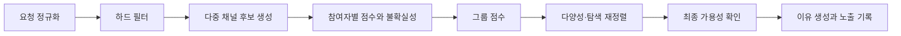

# Davas 추천 전략 상세 설계

> 문서 역할: TO-BE 그룹 추천 전략
>
> 기준 문서: [Davas 제품 기준 문서](../README.md)
>
> 우선순위: 내용이 충돌하면 기준 문서를 우선한다.

## 1. 목표

Davas의 추천은 공간 전체의 일반 인기 순위가 아니라, 이번에 함께 볼 2~5명의 참여자가 지금 실제로 볼 수 있고 누구도 크게 싫어하지 않을 작품을 찾는 과정이다.

좋은 추천은 세 조건을 동시에 만족한다.

1. 시청 가능성: 선택한 지역·OTT·공개 상태에서 실제로 볼 수 있다.
2. 참여자 만족: 평균만 높지 않고 각 참여자의 최소 만족도가 보호된다.
3. 설명 가능성: 노출 이유와 제외·오류 피드백이 검증 가능하다.

## 2. 설계 원칙

- 가용성을 취향 점수보다 먼저 적용한다.
- 데이터 없음은 싫어함이 아니다.
- 평균 점수만 최대화하지 않는다.
- 명시적 거절과 필수 조건은 소프트 점수로 덮지 않는다.
- 새 작품 탐색은 제한된 범위에서 안전하게 수행한다.
- 이유 문구는 실제 계산 근거만 사용한다.
- 한 사용자의 비공개 선호를 다른 참여자에게 노출하지 않는다.
- 모델 학습용 데이터와 제품 분석용 데이터를 목적별로 분리한다.

## 3. 추천 요청

추천 세션은 다음 입력을 가진다.

| 입력 | 설명 |
|---|---|
| `spaceId` | 권한과 공유 경계 |
| `participantUserIds` | 이번 추천에 참여하는 2~5명 |
| `region` | 시청 가능 여부를 판단할 지역 |
| `services` | 공통 또는 허용한 OTT·극장 조건 |
| `contentTypes` | 영화, 드라마 |
| `runtimeRange` | 허용 상영 시간 |
| `moodTags` | 오늘 원하는 분위기 |
| `avoidTags` | 피하고 싶은 장르·소재 |
| `rewatchPolicy` | 이미 본 작품 허용 여부 |
| `language` | 선호 언어·자막 조건 |
| `decisionRule` | 전원 동의 또는 최소 동의 인원 |

서버는 요청자가 해당 공간의 활성 구성원인지, 모든 참여자가 공간에 속하는지 확인한다.

## 4. 출력

추천 결과마다 다음을 반환하고 노출 기록으로 보존한다.

- 정규 작품 ID와 표시용 메타데이터
- 현재 시청 가능한 공급자·상영 상태와 확인 시각
- 참여자별 내부 예측 점수와 불확실성
- 그룹 점수와 순위
- 사용자에게 표시할 검증 가능한 이유 코드
- 알고리즘 버전과 추천 세션 조건

참여자별 내부 점수와 숨겨진 선호 원문은 다른 사용자에게 그대로 보여주지 않는다.

## 5. 필요한 데이터

### 명시적 신호

- 별점과 리뷰에서 사용자가 직접 선택한 태그
- 관심, 관심 없음, 명시적 거절
- 추천 후보 선택과 합의
- 이미 봄, 다시 보고 싶음
- 사용하는 OTT와 요청 시 조건

### 암시적 신호

- 추천 상세 열람
- 후보 비교와 체류
- 추천 후 실제 감상 기록
- 반복해서 선택한 장르·인물·분위기

암시적 신호는 의도가 불확실하므로 명시적 신호보다 낮은 가중치로 사용한다. 단순 노출은 선호로 해석하지 않는다.

### 콘텐츠 특징

- 유형, 장르, 키워드, 국가, 언어
- 감독, 배우, 프랜차이즈
- 공개 연도, 상영 시간, 관람 등급
- 품질 신호와 인기도
- 지역별 OTT·극장 공개 상태

모든 특징은 내부 `ContentTitle`에 연결하고 공급자와 관측 시각을 보존한다.

## 6. 시청 가능성 모델

`AvailabilityObservation`은 다음을 최소 단위로 한다.

```text
contentId + region + provider + offerType + observedAt + expiresAt + confidence
```

추천 시점에는 다음 순서로 처리한다.

1. 요청 지역과 사용 가능한 서비스가 일치하는 관측을 찾는다.
2. `expiresAt`이 지나면 새로 조회하거나 불확실 상태로 낮춘다.
3. 공급자 오류와 실제 제공처 없음은 별도 상태로 유지한다.
4. 최종 노출 직전에 상위 후보의 가용성을 다시 확인한다.
5. 사용자 오류 신고가 들어오면 해당 관측을 즉시 신뢰도 하향 또는 무효화한다.

감상 당시 사용한 `WatchSource`를 현재 시청 가능 여부로 재사용하지 않는다.

## 7. 콜드 스타트

### 사용자 온보딩

60~90초 안에 다음 정보를 받는 것을 목표로 한다.

- 지역과 사용하는 OTT
- 선호 콘텐츠 유형과 보통 가능한 시간
- 피하고 싶은 장르·소재
- 8~12개의 대표 작품에 대한 좋아함·싫어함·모름
- 오늘의 분위기 또는 함께 보고 싶은 유형

대표 작품은 인기작만 나열하지 않고 장르, 시대, 국가, 분위기가 다양해야 한다.

### 데이터가 거의 없을 때

다음 조합으로 시작한다.

1. 하드 필터를 통과한 작품
2. 품질을 보정한 지역 인기작
3. 온보딩에서 선택한 특징과 가까운 작품
4. 목록 안의 장르·국가·연도 다양성

사용자 데이터가 없다는 이유로 공간의 다른 구성원 취향을 그대로 복사하지 않는다. 해당 사용자의 점수 불확실성을 높게 유지한다.

## 8. 추천 파이프라인



### 단계 1: 요청 정규화

- 참여자, 지역, 서비스와 콘텐츠 유형을 검증한다.
- 시간과 분위기를 내부 범주로 변환한다.
- 중복 조건과 모순을 사용자에게 설명 가능한 형태로 정리한다.

### 단계 2: 하드 필터

다음 조건에 어긋나는 작품은 점수 계산 전에 제외한다.

- 지역·OTT·공개 상태 불일치
- 요청한 영화·드라마 유형 불일치
- 상영 시간 또는 관람 등급 제한 위반
- 참여자의 명시적 거절 또는 회피 소재
- `rewatchPolicy`가 금지인데 참여자 중 누군가 이미 봄
- 삭제·차단·라이선스 문제로 노출할 수 없음

후보가 0개면 조건을 몰래 완화하지 않는다. 어떤 조건을 바꾸면 후보가 생기는지 별도 제안한다.

### 단계 3: 후보 생성

한 가지 소스에 의존하지 않고 다음 채널의 합집합을 만든다.

- 참여자 선호 특징과 유사한 콘텐츠
- 각 참여자가 높게 평가한 작품과 가까운 콘텐츠
- 공간에서 함께 만족한 작품의 이웃
- 지역·서비스의 품질 보정 인기작
- 신작과 공개 예정작
- 아직 충분히 탐색하지 않은 안전한 후보

채널별 최대 수를 제한해 인기작이나 특정 장르가 전체 후보를 독점하지 않게 한다.

## 9. 참여자별 점수

사용자 `i`와 작품 `c`의 예측 만족도 `p(i,c)`를 0~1 범위로 보정한다.

초기에는 설명 가능한 특징 기반 모델로 시작한다.

```text
p(i,c) = sigmoid(
    genreAffinity
  + peopleAffinity
  + moodFit
  + runtimeFit
  + qualityPrior
  + noveltyPreference
  - explicitAvoidPenalty
)
```

점수와 함께 불확실성 `u(i,c)`를 계산한다.

- 명시적 평가와 유사 작품 이력이 많으면 불확실성이 낮다.
- 온보딩 정보만 있거나 특징이 부족하면 불확실성이 높다.
- 알려지지 않은 사용자를 중립값에 고정하지 않고 사전분포와 불확실성으로 표현한다.

별점 수가 적은 작품과 사용자는 베이지안 축소를 적용해 극단값을 완화한다.

## 10. 그룹 점수

참여자가 `n`명이고 각자의 보정된 만족도 예측이 `p_i`라면 기본 그룹 점수는 다음과 같다.

```text
mean       = sum(p_i) / n
floor      = min(p_i)
dispersion = standardDeviation(p_i)

groupBase = λ * floor + (1 - λ) * mean - γ * dispersion
```

- `λ`는 0.5~0.7에서 시작해 최저 만족도를 보호한다.
- `γ`는 참여자 사이의 큰 점수 차이를 완화한다.
- 참여자 수가 늘어도 한 사람의 강한 선호가 나머지의 거절을 덮지 못한다.
- 누군가 명시적으로 거절한 작품은 기본적으로 하드 제외한다.

최종 점수는 다음 요소를 더해 구성한다.

```text
finalScore = groupBase
           + contextFit
           + qualityPrior
           + freshnessBonus
           + explorationBonus
           - repeatPenalty
           - uncertaintyRisk
```

각 항의 버전과 값을 노출 기록에 저장해 결과를 재현할 수 있어야 한다.

## 11. 다양성과 탐색

상위 점수만 정렬하면 같은 장르, 배우, 프랜차이즈가 반복될 수 있다. 최종 목록은 MMR 또는 xQuAD 계열 재정렬로 다음 중복을 줄인다.

- 같은 장르와 분위기
- 같은 감독·배우
- 같은 프랜차이즈
- 비슷한 공개 연도와 국가

탐색 후보는 다음 조건을 지킨다.

- 하드 필터를 모두 통과한다.
- 참여자의 명시적 비선호와 충돌하지 않는다.
- 전체 목록의 제한된 비율만 차지한다.
- 탐색 후보임을 내부적으로 기록하고 결과를 평가한다.

## 12. 설명과 개인정보

허용되는 이유 예시:

- 모두가 사용하는 OTT에서 지금 볼 수 있음
- 참여자들이 함께 높게 평가한 작품과 장르가 비슷함
- 오늘 선택한 상영 시간과 분위기에 맞음
- 아직 보지 않았고 최근 공개된 작품임

피해야 할 이유:

- 특정 사용자의 비공개 거절이나 민감한 리뷰 내용을 직접 노출
- 실제 계산에 사용하지 않은 인기·취향을 이유로 표시
- 오래되거나 검증하지 않은 OTT 정보를 확정적으로 표현
- 모델의 낮은 확신을 숨긴 과도한 단정

이유는 자유 생성 문장보다 검증된 `reasonCode + 안전한 표시 파라미터`로 만든다.

## 13. 합의 흐름

- 각 참여자는 관심, 보류, 거절을 표시할 수 있다.
- 기본 합의는 전원 동의다.
- 공간 또는 세션이 최소 동의 인원을 선택할 수 있다.
- 개인의 선택은 합의가 끝나기 전까지 집계 형태로만 보여줄 수 있다.
- 거절 이유는 선택 입력이며 다른 참여자에게 그대로 공개하지 않는다.
- 합의가 오래 걸리면 조건 변경 또는 짧은 후보 목록 재생성을 제안한다.

## 14. 피드백

### 노출 시점

- 관심 있음
- 관심 없음
- 이미 봄
- 시청 가능 정보가 틀림
- 오늘 조건과 맞지 않음

### 감상 후

- 실제 감상 여부
- 개인별 별점과 리뷰
- 함께 본 참여자 확인
- 추천 이유가 적절했는지

`관심 없음`은 영구적인 작품 비선호와 다를 수 있으므로, 가능한 경우 오늘의 상황과 일반 비선호를 구분한다.

## 15. 단계별 고도화

### 단계 0: 결정론적 MVP

하드 필터, 온보딩 선호, 콘텐츠 특징, 그룹 공식과 다양성 규칙으로 시작한다. 모든 결과를 재현할 수 있어야 한다.

### 단계 1: 베이지안 개인화

별점과 피드백이 쌓이면 사용자·작품 사전분포를 갱신하고 데이터가 적을 때의 극단값을 축소한다.

### 단계 2: 사용자별 학습 모델

충분한 개인 데이터가 있는 사용자부터 특징 가중치를 학습한다. 기존 결정론 점수와 비교할 수 있는 폴백을 유지한다.

### 단계 3: 문맥 밴딧

시간대, 요일, 분위기와 노출 피드백을 사용해 제한된 탐색을 최적화한다. 하드 필터와 공정성 규칙은 모델 밖에서 유지한다.

### 단계 4: 협업 필터링

여러 공간과 사용자 풀이 충분히 커지고 익명화·동의·평가 기반이 갖춰진 뒤 도입한다. 초기 두 사용자 데이터만으로는 사용하지 않는다.

## 16. 평가 지표

### 오프라인

- 하드 필터 위반 건수: 목표 0
- 가용성 정밀도와 만료 데이터 비율
- NDCG, Recall@K 등 개인 순위 품질
- 그룹 내 최저 예측 만족도
- 예측 점수 보정 오차
- 결과 목록의 장르·인물·연도 다양성
- 참여자별 노출 편중도

### 온라인

- 추천 요청 대비 후보 선택률
- 모든 참여자의 합의 도달률
- 선택까지 걸린 시간과 재생성 횟수
- 추천 후 실제 감상 기록 전환율
- 감상 후 참여자별 최저 별점
- OTT 정보 오류 신고율
- 추천 이유 도움 됨 응답률

실험 단위는 개인보다 공유 공간을 우선한다. 같은 공간 구성원을 서로 다른 실험군으로 나누면 추천 경험이 오염될 수 있다.

## 17. 운영 안전장치

- 알고리즘 버전별 트래픽 비율을 조절할 수 있어야 한다.
- 새 버전은 오프라인 재현과 소규모 공간 실험 후 확대한다.
- 하드 필터 위반, 가용성 오류 급증, 최저 만족도 하락 시 이전 버전으로 되돌린다.
- 공급자 장애 시 오래된 가용성을 확정적으로 노출하지 않는다.
- 점수 계산 실패 시 인기 순위를 무조건 반환하지 않고 조건을 만족하는 검증된 폴백만 사용한다.
- 노출, 피드백, 최종 선택을 연결하되 리뷰 전문과 위치 정보는 학습 로그에서 제외한다.

## 18. 구현 전 결정할 값

- `λ`, `γ`와 불확실성 페널티의 초기값
- 이미 본 작품의 기본 제외 범위와 재감상 선택 UX
- 가용성 데이터의 공급자별 TTL과 신뢰도 기준
- 후보 채널별 최대 수와 탐색 비율
- 합의 전 개인 의사 표시의 공개 수준
- 별점 외 리뷰 태그를 명시적으로 받을지 여부

초기값은 소수 사용자에게 과적합해 확정하지 않는다. 계산 버전과 실험 결과를 함께 남기고 조정한다.
