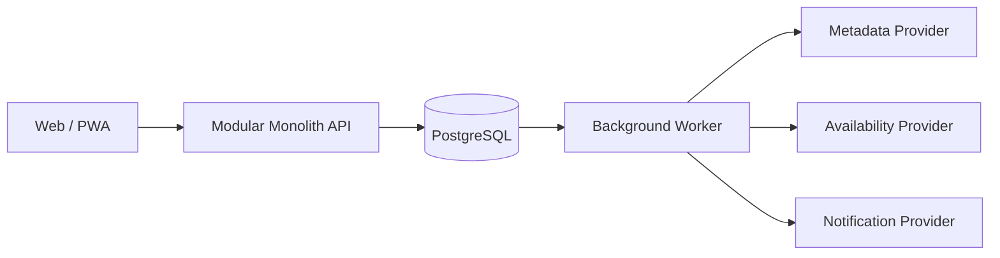

# Davas 기술 아키텍처 상세 설계

> 문서 역할: TO-BE 기술 아키텍처
>
> 기준 문서: [Davas 제품 기준 문서](../README.md)
>
> 우선순위: 내용이 충돌하면 기준 문서를 우선한다. 현재 코드 구조를 설명하는 AS-IS 문서가 아니다.

## 1. 설계 목표

초기에는 연인 두 명이 사용하지만, 공유 공간당 2~5명과 사용자별 복수 공간을 수용할 수 있는 구조를 만든다. 작은 규모에서 운영이 단순해야 하고, 사용자 풀이 확장되어도 핵심 도메인을 다시 설계하지 않아야 한다.

우선순위는 다음과 같다.

1. 공유 공간 경계와 개인 데이터 권한의 정확성
2. 감상 사실과 개인 평가의 분리
3. 외부 작품·OTT 공급자 장애로부터 핵심 기록 보호
4. 추천의 재현성과 개인정보 비노출
5. 작은 운영 규모에 맞는 배포·복구 단순성

## 2. 권장 시스템 구성

초기 구성은 Web/PWA, 모듈러 모놀리스 API, PostgreSQL, 백그라운드 워커다.



- API와 워커는 같은 도메인 코드를 공유할 수 있다.
- 트랜잭션 데이터와 비동기 작업 상태는 PostgreSQL에 둔다.
- 포스터 등 바이너리가 필요하면 객체 저장소를 추가하되 외부 이미지 URL 캐시부터 검토한다.
- Redis, Kafka, 별도 추천 서비스는 관측된 병목이나 격리 요구가 생기기 전까지 도입하지 않는다.

## 3. 애플리케이션 모듈

| 모듈 | 책임 |
|---|---|
| Identity & Access | 계정, 로그인 수단, 세션, 복구, 계정 생명주기 |
| Spaces & Membership | 공간, 구성원, 초대, 역할, 정원, 탈퇴·종료 |
| Catalog | 내부 작품 식별자, 외부 메타데이터 연결, 검색 |
| Viewing Journal | 감상 사실, 참여자 확인, 시청 경로, 개인 반응 |
| Recommendation | 추천 세션, 후보·점수·이유, 노출과 피드백 |
| Notifications | 알림 선호, 발송 요청, 중복 방지, 전달 상태 |
| Provider Integrations | 메타데이터·OTT·개봉 상태 공급자 어댑터 |

모듈은 코드와 데이터 소유권 경계다. 다른 모듈의 테이블을 임의로 갱신하지 않고 공개된 애플리케이션 서비스 또는 도메인 이벤트를 사용한다.

## 4. 핵심 도메인 모델

### 4.1 Identity

| 엔터티 | 핵심 필드 |
|---|---|
| `Account` | id, status, createdAt, deletionRequestedAt |
| `LoginIdentity` | accountId, provider, providerSubject, verifiedAt |
| `Session` | accountId, tokenHash, expiresAt, revokedAt |
| `Profile` | accountId, displayName, avatarRef, locale, timezone |

계정 상태는 최소 `active`, `deletion_pending`, `deleted`를 구분한다.

### 4.2 Spaces

| 엔터티 | 핵심 필드 |
|---|---|
| `Space` | id, name, status, maxMembers, ownerAccountId, version |
| `Membership` | spaceId, accountId, role, status, joinedAt, leftAt |
| `Invite` | spaceId, tokenHash, expiresAt, maxUses, usedCount, revokedAt |

핵심 불변식:

- 활성 구성원은 5명을 넘지 않는다.
- 동일 계정의 활성 멤버십은 공간당 하나다.
- 마지막 소유자는 이전 또는 공간 종료 없이 탈퇴할 수 없다.
- 초대 수락 시 초대 유효성, 중복 가입, 정원을 한 트랜잭션에서 확인한다.

### 4.3 Catalog

| 엔터티 | 핵심 필드 |
|---|---|
| `ContentTitle` | id, type, canonicalTitle, releaseState, runtimeMinutes |
| `ContentLocalization` | contentId, locale, title, synopsis |
| `ExternalContentRef` | contentId, provider, externalId, lastSyncedAt |
| `ContentImage` | contentId, kind, sourceUrl, attribution |

외부 공급자 ID는 사용자의 감상 기록이 직접 참조하지 않는다. 공급자가 바뀌어도 `ContentTitle`은 유지되어야 한다.

### 4.4 Viewing Journal

| 엔터티 | 핵심 필드 |
|---|---|
| `WatchEvent` | id, contentId, authorId, watchedOn, visibility, version |
| `WatchParticipant` | watchEventId, accountId, status, respondedAt |
| `WatchSource` | watchEventId, kind, providerName, placeText |
| `Reaction` | watchEventId, authorId, rating, reviewText, version |
| `WatchShare` | watchEventId, spaceId, sharedAt, revokedAt |

`WatchEvent`는 언제 무엇을 봤는지에 대한 사실이고, `Reaction`은 사용자의 별점과 리뷰다. 공동 감상에서도 `Reaction`은 사용자마다 하나씩 존재한다.

`WatchSource`는 감상 당시의 극장·OTT·기타 경로다. 현재 시청 가능 여부를 나타내는 `AvailabilityObservation`과 합치지 않는다.

### 4.5 Availability와 추천

| 엔터티 | 핵심 필드 |
|---|---|
| `AvailabilityObservation` | contentId, region, provider, offerType, observedAt, expiresAt, confidence |
| `RecommendationSession` | id, spaceId, requesterId, participants, constraints, algorithmVersion |
| `RecommendationExposure` | sessionId, contentId, rank, scoreParts, reasonCodes, availabilityRef |
| `RecommendationFeedback` | exposureId, accountId, kind, createdAt |

추천 결과는 알고리즘 버전, 입력 조건, 노출 순위와 실제 이유 코드를 보존해 재현할 수 있어야 한다.

## 5. 식별자와 공통 저장 규칙

- 내부 식별자는 시간 정렬 가능한 UUIDv7을 우선한다.
- 서버 시각은 UTC로 저장하고 사용자의 시간대와 감상일을 별도로 보존한다.
- 변경 충돌이 중요한 엔터티에는 `version`을 두고 낙관적 잠금을 사용한다.
- 별점은 정수 스케일로 저장할 수 있다. 예: 0.5점 단위를 1~10으로 저장한다.
- 초대·세션·복구 토큰은 원문을 저장하지 않는다.
- 외부 작품 참조는 `(provider, external_id)`를 고유하게 만든다.
- 사용자 입력 텍스트와 공급자 출처·관측 시각을 분리한다.

## 6. 권한 모델

권한은 컨트롤러별 임시 조건이 아니라 중앙 `AudiencePolicy`로 판정한다.

읽기 허용은 다음 조건의 교집합이다.

1. 계정이 활성이고 차단 관계가 아니다.
2. 요청자가 대상 공간의 활성 구성원이다.
3. 상위 감상 기록이 해당 공간에 공유되어 있다.
4. 작성자와 참여자의 공개 범위가 요청을 허용한다.
5. 탈퇴·삭제·공유 철회가 적용되지 않았다.

쓰기 권한:

- 기록과 반응은 작성자만 수정·삭제한다.
- 참여자는 자신의 참여 상태만 확정한다.
- 공간 설정과 초대 권한은 역할에 따라 제한한다.
- 추천 세션은 선택된 참여자만 개인 피드백을 제출한다.

권한이 없을 때는 리소스 존재 여부를 숨기기 위해 일관된 404 응답을 사용할 수 있다. 권한 결정은 캐시하더라도 멤버십·차단·삭제 변경 시 즉시 무효화한다.

## 7. API 원칙

- REST API는 `/v1` 아래에 버전 관리한다.
- 목록은 커서 기반 페이지네이션을 사용한다.
- 생성 요청과 비동기 명령은 idempotency key를 받을 수 있다.
- 경쟁 수정이 가능한 리소스는 ETag 또는 버전 기반 `If-Match`를 사용한다.
- API 응답에는 내부 공급자 원본 구조를 노출하지 않는다.
- 날짜, 시간대, 지역, 공개 범위를 명시적으로 전달한다.

예시 리소스:

```text
POST   /v1/spaces
POST   /v1/spaces/{spaceId}/invites
POST   /v1/invites/{token}/accept
GET    /v1/spaces/{spaceId}/timeline
POST   /v1/watch-events
PATCH  /v1/watch-events/{watchEventId}
PUT    /v1/watch-events/{watchEventId}/reaction
POST   /v1/recommendation-sessions
POST   /v1/recommendation-exposures/{exposureId}/feedback
```

## 8. 트랜잭션과 비동기 처리

한 트랜잭션 안에서 도메인 변경과 아웃박스 이벤트 저장을 함께 수행한다. 워커는 아웃박스를 읽어 알림, 공급자 동기화, 추천 특징 갱신을 처리한다.

권장 도메인 이벤트:

- `SpaceInviteAccepted`
- `WatchEventShared`
- `WatchParticipationRequested`
- `ReactionSaved`
- `MembershipEnded`
- `AccountDeletionRequested`
- `RecommendationFeedbackRecorded`

이벤트에는 리뷰 전문, 위치 텍스트, 숨겨진 개인 선호를 담지 않는다. 소비자는 이벤트 ID를 기준으로 멱등 처리한다.

## 9. 외부 공급자 경계

메타데이터와 시청 가능 여부는 각각 포트로 추상화한다.

```text
MetadataProvider
  search(query, locale)
  getTitle(externalId, locale)

AvailabilityProvider
  getOffers(contentRef, region, observedAt)
  getReleaseState(contentRef, region, observedAt)
```

어댑터는 공급자 DTO를 내부 중립 모델로 변환한다. 각 관측에는 공급자, 지역, 조회 시각, 만료 시각과 신뢰도를 남긴다.

반드시 구분할 상태:

- 정상 조회이며 제공처 없음
- 공급자 오류로 확인하지 못함
- 캐시가 만료되어 신뢰할 수 없음
- 작품 매핑이 없어 조회하지 못함

공급자 장애 시 사용자의 기존 기록과 리뷰는 계속 동작해야 한다.

## 10. 추천 모듈 경계

추천 모듈은 다른 모듈의 원본 테이블을 직접 해석하기보다 읽기 모델을 받는다.

- Catalog: 정규 작품과 콘텐츠 특징
- Viewing Journal: 본 작품, 별점, 명시적 비선호
- Spaces: 추천 참여자와 활성 멤버십
- Provider Integrations: 현재 가용성 관측

출력은 후보 ID, 참여자별 점수, 그룹 점수, 이유 코드와 가용성 참조다. 상세 알고리즘은 [추천 전략](recommendation-strategy-analysis.md)을 따른다.

## 11. 개인정보와 삭제 처리

계정 삭제는 다음 단계로 처리한다.

1. 삭제 요청과 복구 유예 상태 기록
2. 로그인과 새 공유 활동 제한
3. 유예 종료 후 개인 반응, 위치 텍스트, 선호, 토큰 영구 삭제
4. 공동 감상 사실에 필요한 최소 구조만 비식별 상태로 유지
5. 검색 인덱스, 캐시, 분석 저장소, 백업 보존 정책에 전파

탈퇴는 계정 삭제와 다르다. 탈퇴 즉시 해당 공간에서 사용자의 개인 반응과 기여를 볼 수 없게 하되, 다른 구성원이 소유한 데이터는 유지한다.

## 12. 관측성과 운영

- 모든 요청에 상관관계 ID를 부여한다.
- 인증 실패, 권한 거부, 공급자 실패, 워커 재시도와 추천 생성 시간을 구조화해 기록한다.
- 로그에 토큰, 리뷰 전문, 장소 텍스트와 원시 선호를 남기지 않는다.
- 핵심 경보는 아웃박스 적체, 공급자 오류율, DB 백업 실패, 권한 오류 급증이다.
- 백업 복구 훈련과 데이터 삭제 검증을 배포 전후에 반복한다.

## 13. 테스트 전략

### 도메인 단위 테스트

- 공간 정원과 마지막 소유자 규칙
- 초대 만료·취소·중복 수락
- 공동 감상 참여 상태 전이
- 별점 범위와 중복 반응 제약
- 추천 하드 필터와 그룹 점수

### 통합 테스트

- 실제 PostgreSQL에서 제약과 트랜잭션 경쟁
- 정원 마지막 자리 동시 수락
- 아웃박스 저장과 멱등 소비
- 공급자 어댑터 계약과 실패 상태 구분
- 탈퇴·차단·삭제 후 권한 차단

### 종단 간 테스트

- 가입 → 초대 → 2~5명 공간 구성
- 감상 기록 → 참여 확인 → 각자 평가
- 타임라인 공유 → 탈퇴 후 접근 차단
- 추천 요청 → 합의 → 감상 후 피드백
- 계정 삭제 요청 → 복구 → 최종 삭제

가시성 정책은 가능한 조합을 생성하는 속성 기반 테스트로 누락을 찾는다.

## 14. 단계별 확장

### 1단계: 비공개 2~5명

모듈러 모놀리스, PostgreSQL, 워커로 핵심 흐름을 검증한다.

### 2단계: 친구와 복수 공간

친구 관계, 특정 친구 공유, 공간 전환 UX를 추가하되 `Account`와 `Space` 경계를 유지한다.

### 3단계: 큰 그룹

6명 이상 정원, 관리자 역할, 다수결·정족수 합의, 알림 묶음을 별도 요구사항으로 설계한다.

### 4단계: 공개 탐색

신고, 차단, 검색 노출, 콘텐츠 검토, 속도 제한과 운영 도구가 준비된 뒤 공개 범위를 추가한다.

서비스 분리는 다음 조건이 실제로 관측될 때 검토한다.

- 공급자 동기화가 API 안정성을 반복해서 해침
- 추천 계산이 독립적인 배포·확장을 요구함
- 알림 처리량이 핵심 트랜잭션 운영을 방해함
- 팀 소유권 경계가 모듈 경계를 넘어 독립됨

## 15. ADR로 확정할 항목

- 인증 방식과 세션 저장 전략
- 대한민국 메타데이터·OTT 공급자 선정
- 기본 공개 범위와 탈퇴 후 공동 기록 보존 규칙
- 계정 삭제 유예·백업 보존 기간
- 이미지 저장·프록시 정책
- 추천 특징 저장 방식과 알고리즘 버전 관리

이 항목은 공급자 약관, 운영 환경, 현재 코드와 테스트를 확인한 뒤 `docs/decisions/`에 기록한다.
